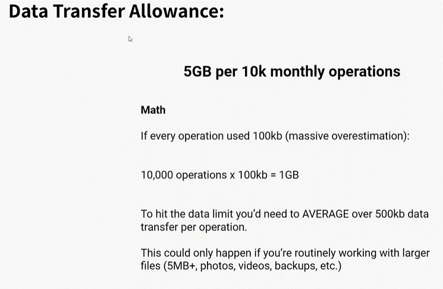

# Plans and operations 

1. The Array Aggregator is not the only aggregator module you can use in Make. There are other lesser-known apps that also allow you to run aggregations (CSV, JSON, Archive).
2. The Numeric Aggregator takes numeric values, performs an aggregation function (SUM, AVG, COUNT, MAX, MIN), and returns the result in one bundle.
3. The Text Aggregator merges values from the selected fields of received bundles into a single text.
4. The Table Aggregator merges values from the selected fields of received bundles into a single bundle using a specified column and row separator (which allows you to create a table).
5. The Array Aggregator merges several bundles into one single bundle as items in an array.
6. Source module - the module from which the bundle aggregation will start.
7. Aggregators allow you to create one output bundle from multiple input bundles but it may not always be the case. If you use the "GROUP BY" option, it's still possible the aggregator will produce more than one output bundle.
8. Target structure type - structure into which the output data will be aggregated.

# [<-- BACK](plans_and_operations.md) --- [NEXT -->](.md)

