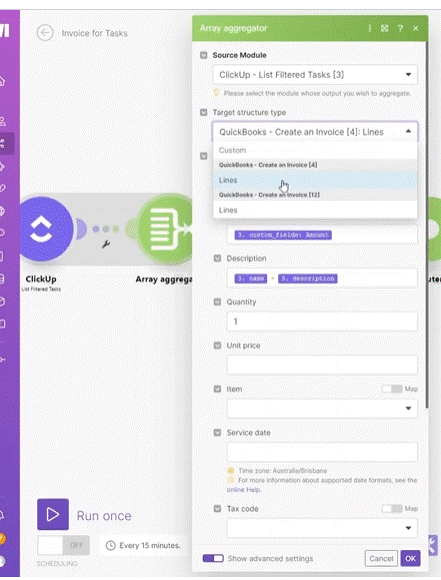

# AI Assistant 

1. The AI Assistant can be found in two different places:
   `1. Directly on the scenario canvas in the bottom right corner - typically, you will use this to get help with your __overall scenario design:__
      1. Creating a scenario draft
      2. Finding the right template
      3. Creating a JSON
      4. Help with errors
      5. Generating HTTP from cURL
      6. Other random questions you may have about your scenario
         
  `2. Within mapping panel when you are editing module fields - typically, you will use this to generate a formula or a piece of text to help you with module __configuration.__
     
2. Be specific when providing instructions.
3. Always check and test the outcomes produced - be ready to fix or add missing pieces.
4. Provide feedback to the Assistant to help us make it better.
5. Keep in mind the AI capabilities always evolve - it is possible that by the time you watch this video, there will be more predefined use cases available (the video was recorded in January 2025)

# [<-- BACK](aggregators.md) --- [NEXT -->](.md)

