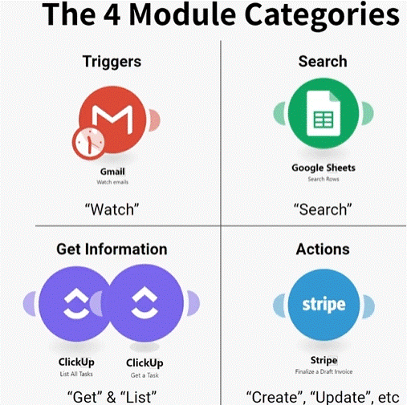

# Basic

## Module Categoires

  

## Trigger Types

|                   |                             Polling                                          |                      Webhook                                |
|:------------------|------------------------------------------------------------------------------|-------------------------------------------------------------|
|                   |  * Runs once schedule                                                        |  * Runs instantly                                           |
|                   |  * Delay between action & Make being alert                                   |  * 1 at a time                                              |
|                   |  * Can retrive many bundles at once                                          |  * Only when needed                                         |
|                   |  * Happens even if there is nothing new                                      |                                                             |
| __Best for:__     |                                                                              |                                                             |
|                   |  * scheduled (i.e once per day)                                              |  * Time sensitive (need to be instant)                      |
|                   |  * Extremely high volume (100+ per day), where there is no time sensitivity  |  * General                                                  |
