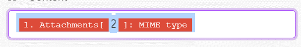

# Data mapping

  * Mapping items between modules can be achieved by simply clicking items in the mapping panel or by dragging and dropping them from the mapping panel.
  * Whenever you need to map items that aren't available in the mapping panel, you can hardcode them by using the __double-curly brackets trick__. E. g. you can type {{1.order.order_id}}. Just keep in mind that you always need to refer to __"raw names"__ (to find the raw name you can do by hovering the mouse on the variable and a pop up massege will sow the row name).

    example
       {{3.messageid}}
       
  * Even mapped items can be copied and pasted between modules: Just select them and use CTRL+C and CTRL+V on your keyboard to copy and paste, respectively. Sometimes you may need to go a step further and copy a mapped item (or a combination of inline functions) out of Make and edit it as plain text in a text editor - and then paste it back to Make. This is very useful when you need to edit long nested inline functions.

tip:

In an array type of variable by default the setting will take the first in the list. by adding a number between the  array and the variable you can reffer to a nother list in the array.

example:

     
     
     {{1.attachments[2].contentType}} 
     
