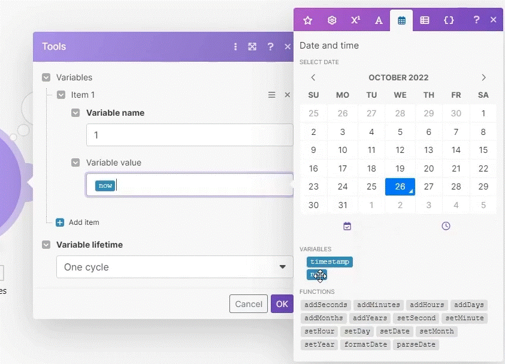

# Date and General Inline Functions

1. You can "chain" or "nest" functions together. You are not limited to using just one function for an item. For example: addMonths(addSeconds({{now}};2);13).
2. Beware of all possible date/time tokens which can be used for date/time formatting - full list on the link below.
3. Please check advanced use cases of date/time functions here. The article covers:
   1. How to calculate days between dates - extremely useful!
   2. How to calculate the nth day of the week in a month.
   3. How to transform seconds into hours and minutes.
      
4. General functions such as if(...), ifempty(...), switch(...) allow you to build conditional logic within your mapping. 

__under Date Functions:__

   __VARIABLES__
   * __now__ - output the current date is now.
   * __timestamp__ - a uniqe code (number) representing the time (since 1/1/1970 GMT)

   __FUNCTIONS__
   * __add__ (addSeconds, addYears, addMonths....etc) - add months to the calculation (ex. addMonths (now ; 2) - will add 2 months from today)
   * __set__ (serSeconds, setMinuts, setYear...etc) - set the date to a specific date (ex. set day to monday (2) - setDay(now;2) - will retrive the 2 day of the week of the now date value).
   * __parseDate__ - will take a date and try to understand it (ex. parseDate(date; format; [timezone] (optional)) - will try to convert a variable into a date in the format set).
   * __formatDate__ - format the date in a specific format you wish (ex. formatDate(parseDate(2022 15---2; YYY DD---M); Do MMM YY -  will return 15th Feb 22).

__example__

   retrevie the time between timestemp and the email date (in unix format ("X"))

         {{timestamp}}-{{formatDate(1.date; "X")}}

         this will return the value in dayes
         
         ({{timestamp}}-{{formatDate(1.date; "X")}} / 60 / 60 / 24 - this mite reurn NOT a round number (ie. 24.96 days))

         round the date

         round(({{timestamp}}-{{formatDate(1.date; "X")}} / 60 / 60 / 24 - this mite reurn NOT a round number (ie. 24.96 days)))

## Conditinal Logic

__if__

generate True or False

      if( expression; value; value)

   ex.

      if ( 1 = 1 ; if true-do this ;  if false do this)

__ifempty__

      ifempty( value1; value2)

      Reurn Value1 if its not empty. if it is it return value2.

      ifempty("", B) - will return B

__switch__

      switch(expression; value1; result1; [value2; result2;....] [else})

      Evaluates one value (called expression) against a list of values, and return the result coresponding to the first match value.

      switch(B; A; 1; B; 2; C; 4) - will return 2

      * if you put a extra value at the end (as else) it will return this value if it doesnt find one suited in the list of values in the function.
      

## Variables

when we reuse a value that mite change over time.
 (3 tyoes of VARIABLES - SCENARIO, TEAM, and ORGANIZATION - changing the variables done in the web interface)
 
   __example:__

   * __businessname__
   * __admincontact__
   * __businessurl__

# [<-- BACK](math_and_string_functions.md) --- [NEXT -->](routers_and_filters.md)

