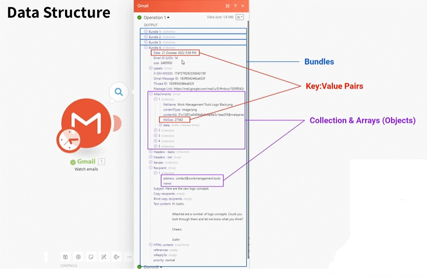
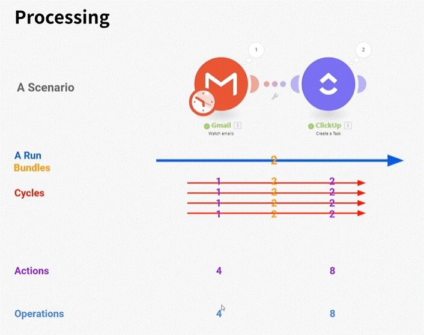
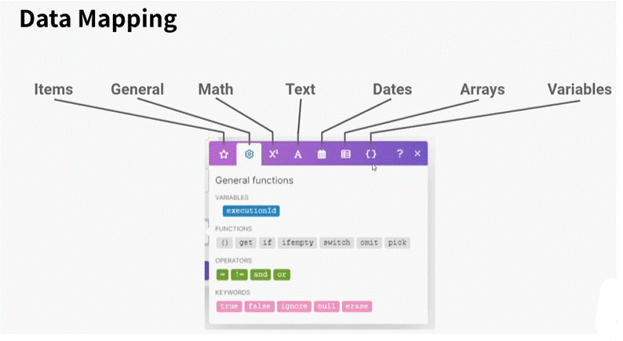
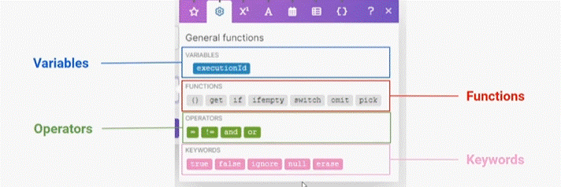

# Definitions and terminology

1. __Bundle__ - a chunk of data and the basic unit for use with modules. A bundle consists of items, similar to how a bag may contain separate, individual items.
2. __Item__ - data that is part of a bundle.
  1. __Collections__ - a set of different data items.
  2. __Arrays__ - data items of the same type. Array items have "[ ]" at the end of the item name in the mapping panel.

3. __Scenario__ - series of app modules connected to perform a task or automate a process or workflow.
4. __Module__ - the main building block of automation in Make. Modules represent actions that Make performs with an app. Each app typically contains several modules that read, create, update, and delete data.
5. Scenario "execution" is a synonym for scenario "run".
6. Generally speaking, Make will charge for operations whenever a bundle passes through a module but there are certain modules that don't charge operations.
7. Mapping Panel lets you map items coming from preceding modules into the current module.
   
## Data Structure

the structure of the Data being "pulled".

## Processing

  * __Run__ running the all scenario. (i.e if its runs once na hour the all process)

  * __Bundle__ withing each run there can be multiple Bundels (i.e pulling emails once with many emails inside (each email is one bundle))

  * __Cycle__ for pulling triggers we can set the pull into multiple cycle to retrive less bundels in one operation (good when there are errors, so its better to devide the inputs). __(not relevent to webook - each has one cycle)__

  * __Actions__ - how many times each module run (how many operatins being used in the run).

  * __operations__ usualy, the number of times the modules runs (usualy actions there are some moduls that are free).

## Data Mapping

handle data recived from a module

__items__ the data being recived from the module. like a set of key values.

__General Functions__  condition logic (i.e "if","switch" etc.)

  * __Math__ math functions.

  * __Text__ text functions.

  * __Dates__ date functions.

  * __Arrays__ arrays functions.

  * __variables__ use varibales we have defined.

in each data function there are sets operations:

  * __variables__ - fix variable that retrevie from the module (i.e "now" in date will add the time and date).

  * __Functions__ operatin functions to execute (i.e "if" , "get", "pick" etc)

  * __Operators__ operators to be used (i.e "=","!=", "or" and "and")

  * __Keywords__ set a key words to be used as constant (i.e "null", "true", "space", "tab", "newLine")
