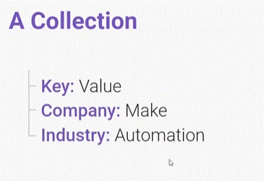
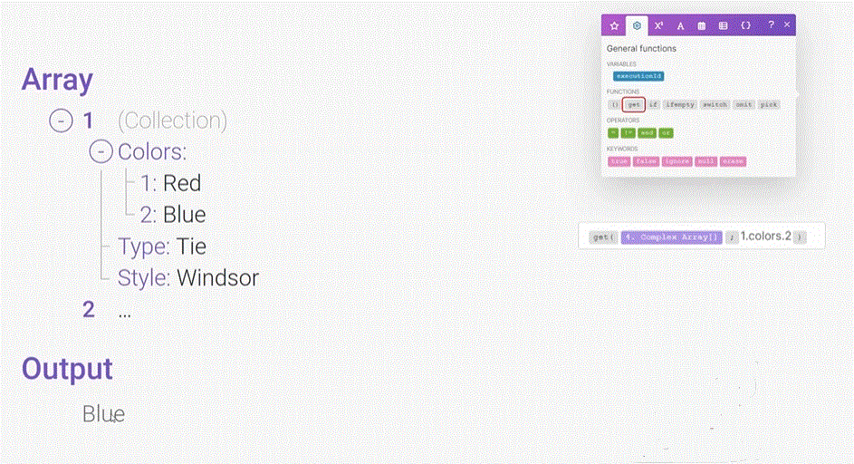
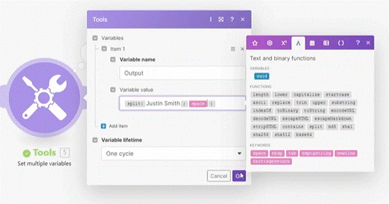
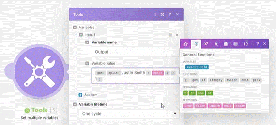

# Array Basics 

__Things to remember:__

1. An array is a list of items.
2. Arrays can be identified by having "[ ]" at the end of item names in the mapping panel.
3. Array functions can help you save operations and lots of steps that would otherwise have to be done via standalone modules.
4. Hover over the individual value field to see the Raw name of the field.
5. get(...) function allows you to access nested elements, using dot notation.
6. split(...) function lets you create arrays from text strings.
7. join(...) function lets you create a simple text string from a primitive array.

## Array

An array is a list of items.

__Array of values:__

__Collection__

A collection of key value pairs

__Array of Collections__

An Array that contain a list of values that are a __Collections__ type. meaning a key value pair in each item of the Array.

__* NOTE__ in a collection there can be a __Array__ (ex. list of indusrty). and the opposite as well ( a collection in a Array , an Array in an Array...etc)

### Accessing an Array

In order to extract or handle values within an Array there are some opetions:

__GET__

 get(...) function allows you to access nested elements, using dot notation.
 

another way of using __get__ is for extracting a value from an array (if you need a text value. extracting the value will result in an error beacuse the type of fied is still array). in order to extract it as a text you can use the __get__ function;

      creating a simple Array (for the example)

      you can see it split the name into two. each places in a ceparate value (extracting this value is type Array).

      In order to extract it as a __Text__  type:
      

  
# [<-- BACK](aiassistant.md) --- [NEXT -->](.md)

