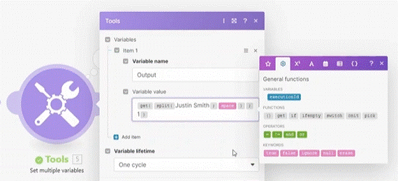

# Array Basics 

__Things to remember:__

1. If you need to create a new array with values, use add(empty array; item1; item2).
2. Hover over the individual function to see its explanation.
3. join(...) function lets you create a simple text string from a primitive array.
4. length(...) function gives you the number of items in an array.
5. keys(....) function return an array of keys, more applicable with collections.
6. slice(...) function allows you to create a new array with selected items.
7. merge(...) function merges two or more arrays into one.
8. contains(...) function verifies if an array contains the value, the output is true or false.
9. remove(...) function removes an item from an array.
10. add(...) function adds an item to an array.
11. map(...) function allows filtering values in a complex array.
12. shuffle(...) function reorders items randomly in an array.
13. sort(...) function sorts items of an array.
14. first(...) and last(...) functions give you the first and the last item of an array, respectively.
15. flatten(...) function takes nested array items and puts them all into one.
16. distinct(...) function removes duplicates inside of a complex array based on the provided key.
17. deduplicate(...) function removes duplicates from a simple array.
18. toCollection(...) function converts an array to a collection.
19. toArray(...) function converts a collection into an array of key-value collections.
20. omit(...) function removes items with the given keys from a collection.
21. pick(...) function picks items with specified keys from a collection.

  
# [<-- BACK](l3arraybasics.md) --- [NEXT -->](l3arrayiterator.md)

