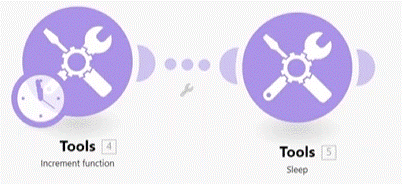
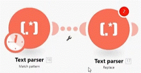
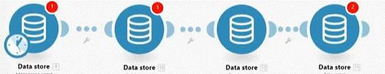
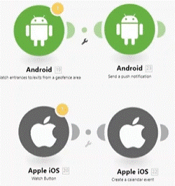
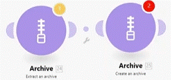

# Built-in apps

__Things to remember:__

  1. You'll likely find available apps to solve many of the challenges for which you might have thought there is no app available :)
  2. Built-in apps are native Make functions and utilities, like Tools, Flow Control, Text parser, and many others.
  3. Repeater allows repeating a task a given number of times.

## Repeater

allow to start in an anitial number and count to a number (can do steps). each run create a bundule.

## Phone number

allow to map-in a number and pass him as phone number.

## Increment Function & Sleep

__Increment Function:__ will increase the number for each time this toll being used.

__Sleep:__ will delay for certain number of second (between 1 to 300 sec).

## Text parser (Match patern & Replace)

__Match patern:__ Allow to pull values out of some text (you give it a word and it try finding it in the text).

__Replace:__ same as __Match patern__ but allow replacing the value in the text.

__Match element:__ Allow to input some incoming text and then pull out a pre-set pattern (email, HTML tagm phone number....etc).

## CSV (Create & Parse)

__Create:__ agregate to CSV. where each bundle is a line (add lines to a csv).

__Parse:__ look in an exsiting CSV file and pull out the information.

## Data store

(__Make__ data store allow saving information (not more then 1M) on the __Make__ platform )

Can use it save information between scenarios executions or Runs.

action that can do on with the Data store apps:

  * __Add/Replace__ - add or replace a line in the Data store.
  * __Update:__ update line in Data store.
  * __Search:__ search in the Date stroe.
  * __Get:__ get information from the Date store.
  * There are more types....

## HTTP

Allow us to send any API request to any software.

## Webhooks

Allow us to connect to any webhook anywhere in the web. 

The __Webhook__ allow to connect and listen to other webhooks (that dont have __Make__ build-in app) for new incoming connection (message), it can be done;

  * __uniqe Address__ the Webhooks provide a uniqe address to inform the out side webhooks to send a email if any change happen.
  * __email__ the Webhooks provide a uniqe email addres to inform the out side webhooks to send a email if any change happen.

## Android & Apple apps

Give us many triggers and actions to interact with our phone 

ex. :

  * Watch entrance to/exit from a geofence are (do an action if you enter or leave a geografic area).
  * Watch button - if we trigger a button on the phone it triggers a scenario.
  * crate a calander event on the calander of the phone.
  * and much more........

## JSON

## Archive

Extract or creating a Archive file (zip).

## Currency

Allow us to convert between two currency's (it keep updated with the rates - using the European cetral bank rates).

__AND MORE ..........__

  
# [<-- BACK](l3iterator.md) --- [NEXT -->](l3introductiontoerrorhandeling.md)

