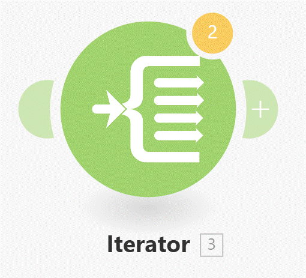

# Built-in apps

__Things to remember:__

  1. You'll likely find available apps to solve many of the challenges for which you might have thought there is no app available :)
  2. Built-in apps are native Make functions and utilities, like Tools, Flow Control, Text parser, and many others.
  3. Repeater allows repeating a task a given number of times.

  
# [<-- BACK](l3iterator.md) --- [NEXT -->](.md)

