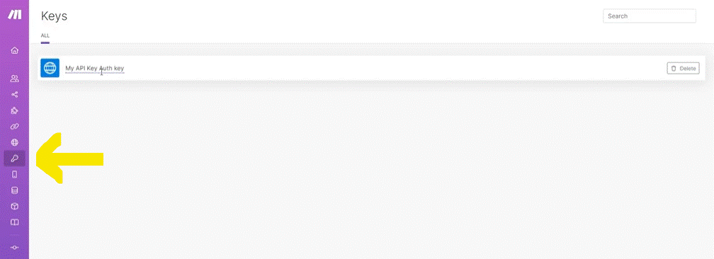

# Intro to API and HTTP app

__Things to remember:__

1. Don't underestimate our Help Center. It offers a ton of great content both on general concepts of working with Make as well as on particular apps supported by Make.
2. Help Center never sleeps - new content is regularly being added.
3. You can also submit a support ticket here or directly from your Make organization (Help menu at the bottom right corner).
4. Consider also posting your questions to Make Community.

  
# [<-- BACK](l3introtoapiandhttp.md) --- [NEXT -->](.md)

