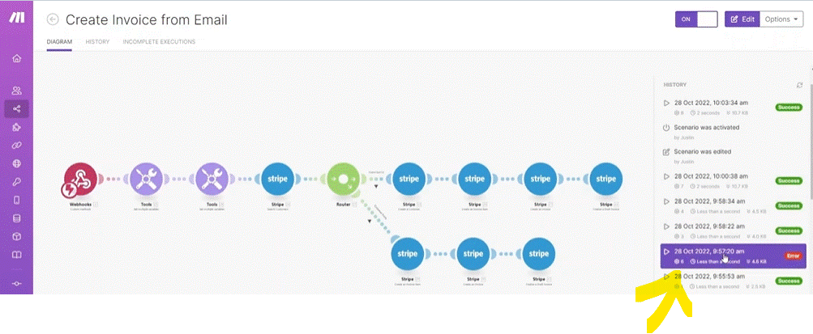
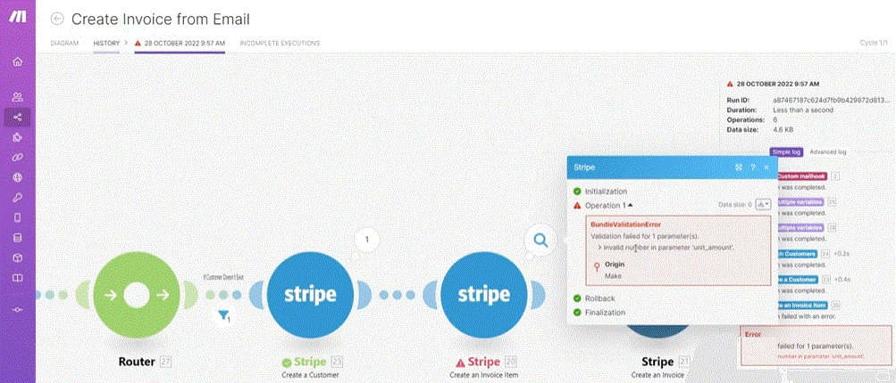
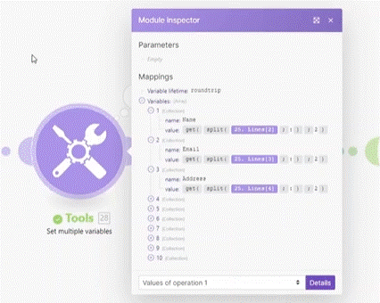
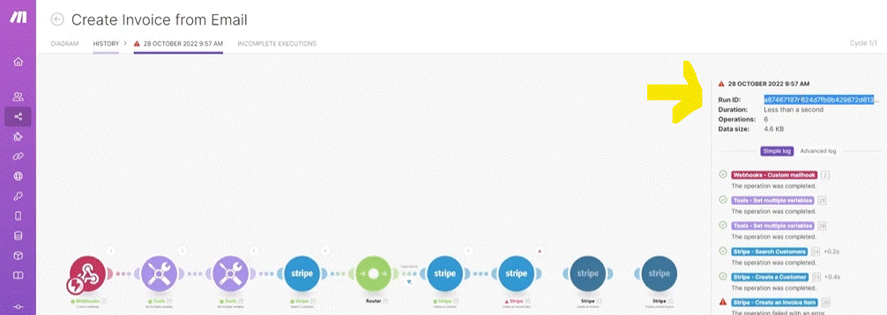
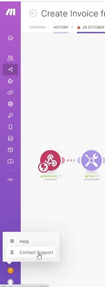

# Getting Help

__Things to remember:__

1. Don't underestimate our Help Center. It offers a ton of great content both on general concepts of working with Make as well as on particular apps supported by Make.
2. Help Center never sleeps - new content is regularly being added.
3. You can also submit a support ticket here or directly from your Make organization (Help menu at the bottom right corner).
4. Consider also posting your questions to Make Community.

### If somthing get wrong with Make;

1. first check the scenarion logs (we enter the scenario)

   we can see the different runs on the main scenario screen and check the wrong one's for errors.
   

  we look at the error itself inside the scenario (on the module that is with error)

__* Tip__

* If you have a complex scenario where you have truble determinating the error. you can add a "Set multiple variables" (Tool). so you can test out individual parts of it. and see which one was it that didint work well.

* __finding the Run ID__ - in case you need to open a support ticket you can find the runer id on the details of the runs scenarios;

2. __Help Center__ - on the help center to serch for article for the issue you need.

There two type's of Information in the "__Help Center__";

  * General information about __Make__.
  * Information about specific app's.

3. __Contact Support__ open a ticket at __Make__ (opening button is next to the help on the web page) wher you can submit a question and support will get back to you (try to provide as much information you can, like Run-ID, URL of the scenario, screen shut...etc').

4. Community - the community of Make can offer many kind of help solutions.
  

  
# [<-- BACK](l3introtoapiandhttp.md) --- [NEXT -->](.md)

