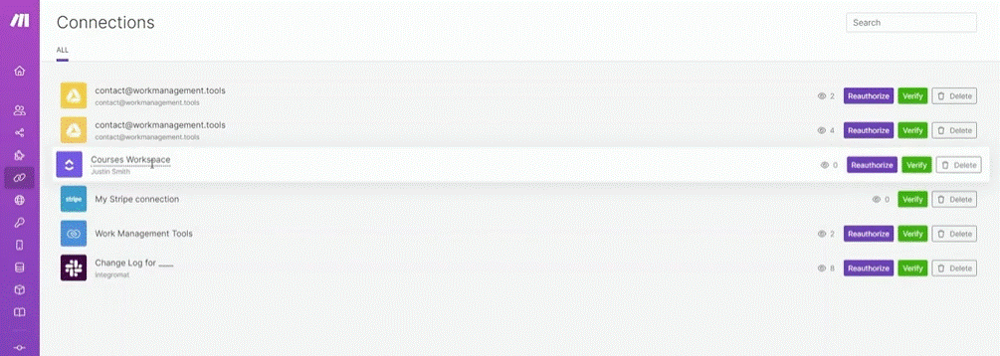

# Managing connections

__Things to remember:__

1. You can test existing connections by clicking the Verify button. For that, you need to navigate to the Connections menu and find the particular connection you need to test.
2. You can also reauthorize existing connections, but only those that support reauthorization flows = mostly OAuth 2.0 based connections where you login through your existing app account and approve Make to access the particular app.
3. Created connections are always bound to the team in which they were created. (Organizations on Free, Core and Pro plans have just 1 team.)
4. When setting up a scenario, only team members with the "Team Member" or "Team Admin" role can use existing connections within the team.
5. Some of the connections can be edited - typically, you will want to change your API keys or secrets without having to replace the connection in affected scenarios. This feature is currently being rolled out app by app and therefore some app connections may not be enabled yet but could be in future.

  
# [<-- BACK](l3managingconnections.md) --- [NEXT -->](.md)

