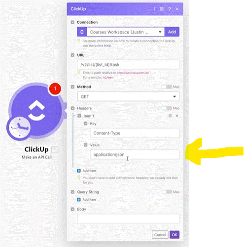

# Intro to API and HTTP app

__Things to remember:__

1. When your scenario is executed, Make is making API calls to the endpoints of services (apps) used in the scenario.
2. The HTTP app allows you to connect to any standard API - even to the apps and services which are not available on Make yet.
3. When working with external APIs, it's important to understand the authorization mechanisms of the particular APIs. For that, you should consult the app's API documentation.
4. The API documentation will also tell you whether to put your request parameters (URL query string, body...)
5. If you want to practice your HTTP module skills, you can try retrieving London time via https://www.timeapi.io/swagger/index.html
6. When API documentation mentions "query parameters" e.g. to filter down your requested data, they usually need to go to the "Query Strings" section in Make's "Make an API Call" module.
   1. You could also directly put these parameters behind "?" in your URL - putting parameters into the URL is __equivalent__ to "Query Strings" but it just may be less user-friendly to read the module information.
   2. However, there might be APIs where filtering is done via "Body". This simply depends on the particular API you are working with and you need to read its documentation properly.
  
   

__API__ 

Like a menu of commant. it is in __JSON__

The __Make__ user interface create the __JSON__ file needed.

### if a app/Action Not available on Make;

## Using API

1. If the app we trying to establish API exsist in Make but it can't do what we want.

   we go to the API web and see if what we need exsist . and see if there is another endpoint that do what we want (on the API web page).  if so we look for the command needed and set it on a module "Make an API Call" where we can set the manualy command (we got from the API web).
   

### Querty Parameters

Depends on the API. some queryes parameters would be sent after the URL (after "?") __Or__  query need to be filed in the ""Query String" field in the setting of the module.

### Request type (API Header)

On the  API page you need to see the type of file it needed (sometimes it under Hiden Parameters) - Most API are using __JSON__ format. 
In case you need to adjust the format.

  
# [<-- BACK](l3managingconnections.md) --- [NEXT -->](.md)

