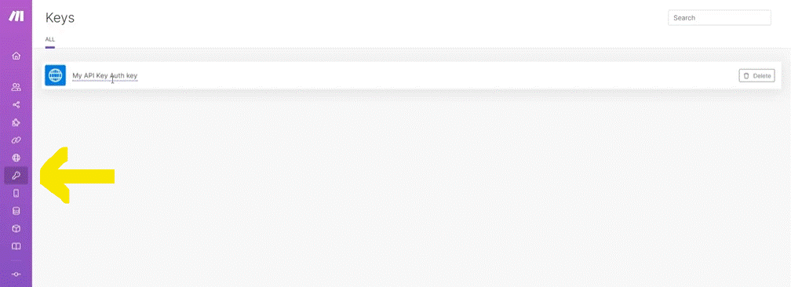

# Intro to API and HTTP app

__Things to remember:__

1. When your scenario is executed, Make is making API calls to the endpoints of services (apps) used in the scenario.
2. The HTTP app allows you to connect to any standard API - even to the apps and services which are not available on Make yet.
3. When working with external APIs, it's important to understand the authorization mechanisms of the particular APIs. For that, you should consult the app's API documentation.
4. The API documentation will also tell you whether to put your request parameters (URL query string, body...)
5. If you want to practice your HTTP module skills, you can try retrieving London time via https://www.timeapi.io/swagger/index.html
6. When API documentation mentions "query parameters" e.g. to filter down your requested data, they usually need to go to the "Query Strings" section in Make's "Make an API Call" module.
   1. You could also directly put these parameters behind "?" in your URL - putting parameters into the URL is __equivalent__ to "Query Strings" but it just may be less user-friendly to read the module information.
   2. However, there might be APIs where filtering is done via "Body". This simply depends on the particular API you are working with and you need to read its documentation properly.
  
   

__API__ 

Like a menu of commant. it is in __JSON__

The __Make__ user interface create the __JSON__ file needed.

### if a app/Action Not available on Make;

## Using API

### If the app we trying to establish API exsist in Make but it can't do what we want.

We go to the API web and see if what we need exsist . and see if there is another endpoint that do what we want (on the API web page).  if so we look for the command needed and set it on a module "Make an API Call" where we can set the manualy command (we got from the API web).
   

### Querty Parameters

Depends on the API. some queryes parameters would be sent after the URL (after "?") __Or__  query need to be filed in the ""Query String" field in the setting of the module.

On the module you can set the query Parameters in 3 ways (depends on the need and the API requermrnts);
1. __Query string__ -  enter a key and a value ( we got from the API web)

2. __Body__ - using the body section there need of perticulate format we need to follow:

__Array__ - in case the parameter we need is an array type, the parameter set;

3. __URL__ - some api need to be query set on the url itself:
   

__X-WWW-from-urlencoded__

Another format (not __JSON__) that sometimes is used by API's. if this is the case the best practice to set the parameters is by the __Body__ part (not __Query String__).

The setting is done;

__On Array Parameters__

### Request type (API Header)

On the  API page you need to see the type of file it needed (sometimes it under Hiden Parameters) - Most API are using __JSON__ format. 
In case you need to adjust the format.

Example for __API Call__ setting.

### If the API is not already in Make (there is no mudles for that API)

We use the __HTTP__ moudle that allows us to make some API request to any app in the internet that have an API accesable.

__HTTP (Get a file)__
What it will do is take a __URL__ and downloading the file from there.

__* Note__ there are some cases the link is to a drive (it will download the page not the file (ex. google drive)). in this case there is a "google" moudle for downloading a file.

__HTTP (Make a request)__

This moudle is similar to the API modules created by Make.

__* Note__ this moudle don't have __Authentication__ (see next for URL that need Authentication).

__If Authentication__ is needed, there are __HTTP__ supporing diferent type's of Authentication methods (Ex. by using user name and passward - using the Make a Basic Auth request module. or by API key (we got from the API provider) that will do using module - using the Make an API Key Auth request module).

__HTTP (Make an API Key Auth request)__

Make API request with Key Authentication.

__* Note__ once you created an API key in the moudle. the key's will be saved "keys" page (on the web)

  
# [<-- BACK](l3managingconnections.md) --- [NEXT -->](l3gettinghelp.md)

