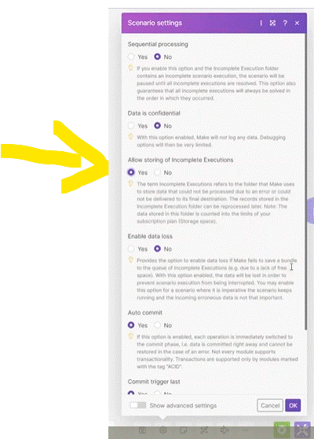
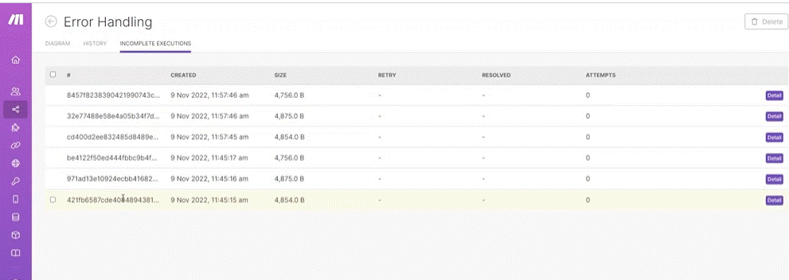
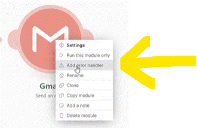
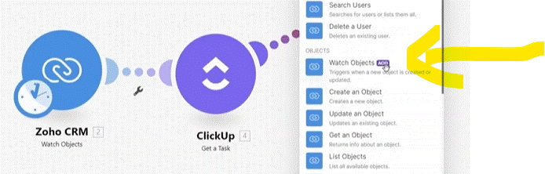
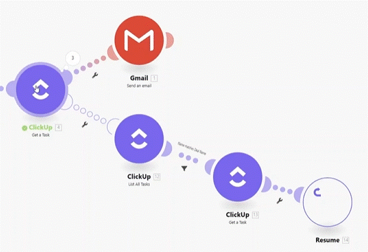

# Introduction to Error Handling

__Things to remember:__

1. Your scenarios may generate random errors which will not be your fault. For example, it's possible that one of the modules in the scenario fails because the API of the particular app is not responding for a very short period of time.
2. You can solve these situations by using error-handling modules such as Ignore, Break, or Resume.
3. You can even create alternate routes with a series of steps to solve the error. Right-click a potentially failing module > Add error handler > Select any app on Make.
4. Error handlers are especially useful when you know certain errors will be repeatedly happening and when you already know how to handle these errors.

  * If an error occured the all scenario may stop working (turn off) (on a warning it allow more to occure before stoping (turn off) the scenario.)
  * __notification__ you can get notificatins both on errors and warning by setting them under Team --> Notifications --> set the roles to get the notification )
  * by checking to "Yes" for the "Allow storing of Incomplete Executions" you can insted of canceling out. youll get a warning and the scenario will continue processing all the bundles:

Every scenario has it error handling list. under "INCOPMLETE EXECUTIONS" you can see all the detailes of the incomplete execution.

## Error handler

a route that will be trigger if an error occured.
Try to avoid using __Error handlers__ in a scenario. use them where the errors are rutine and happen on the same place (moudle) every time.
if in a scenario you identify where people enter information (human error or missing/incomplete data) you mite consider using a __Error Handler__.

there are some build error handlers (if you dont use a moudle):

  * __Rollback__ - requier that all the modules will be __Asid__ (Atomic, Consitent, Isolated and Durable - can easyly undone without doing problems to the Data). in order to know it the opject is "ASID" there is a tag next to each module.
 * __Commit__ - requier that all the modules will be __Asid__ (Atomic, Consitent, Isolated and Durable - can easyly undone without doing problems to the Data). in order to know it the opject is "ASID" there is a tag next to each module.
   

    
 
  * __Break__

    
    
    * it allow to have intermidiate between request by an interval given (ex. in case we ask to many data and the api delay our request, that can do an error).
    * save the scenario in our incomplete execution. never allow an execution to be lost. for future handeling.

__* NOTE__ in order to break to work we need to set the "Allow storing of incomplete Executions" set to __Yes__ (under setting of the scenario)

    
  * __Resume__

it ignore the moudle and continue with the scenarion. you can also enter information that would have been the output of this moudle. 

    Resume can be used in two ways:
     * as a stand alone

       
       
     * or, at the end of an __Error handler__ route (it will return to the main moudle and continue the scenario (its the only handler that can do that))

     (in this example the senarion on a error on clickup (moudle 3) will go throw the route of the error handler where it will list the tasks , using filter it will pass only the right task to another click-up module where it pulls the info ths the couse of the error. the Resume will return the corect valuse (by setting it on the resume) and go back to continue the scenario as a success.
     
      
    
  * __Ignore__

    if the moudle who has a __Ignore__ handler. if the module has an error it will ignore the all scenario. it will stop immidiately but it will treat the moudle as successfully run.
__* NOTE__ because __Ignore__ doesnt finish the scenario (stop at the Ignore moudle) and mark it as successfull. there is no notification or log that somthing went wrong.

  
# [<-- BACK](l3built-inapps.md) --- [NEXT -->](.md)

