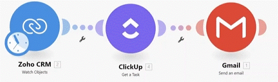
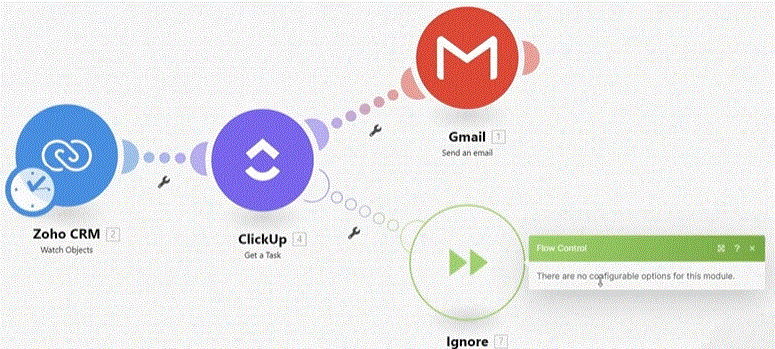

# Introduction to Webhooks and Mailhooks

__Things to remember:__

1. If you need to receive data from external apps which are not supported on Make yet, there is a high chance that the app is able to deliver data via webhooks - in that case, you can use the "Custom webhook" module to receive this data in Make.
2. While you will set most of the webhook-based scenarios to be triggered instantly, it's still possible to schedule these scenarios to run on a regular frequency.
3. By default, scenarios with instant webhooks are processed in parallel. Even if a previous scenario execution is still being processed, Make does not wait for its processing to complete. To turn off parallel processing, open the settings of your scenario and select "Sequential processing". With sequential processing enabled, Make waits until the previous execution is complete before starting the next one. Also, use sequential processing when you need to process your webhook requests in the order that they are sent and received.
4. You can configure what data structure to expect in the webhook request payload.
5. To test your webhook you can use the HTTP module to send a request.
6. Don't forget about the "Custom mailhook" module, which allows you to process incoming emails instantly. This can be a workaround solution for platforms that don't support webhooks but are able to send emails based on specific events.
7. You can check past webhooks payloads (up to 3 days old) by going to Webhooks in the main left-side panel and clicking on the webhook you want to examine.
 

  
# [<-- BACK](l3introductiontoerrorhandeling.md) --- [NEXT -->](.md)

