

# Introduction to Webhooks and Mailhooks

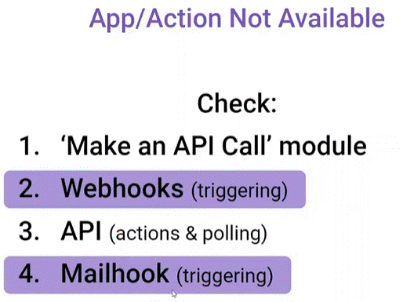

__Things to remember:__

1. If you need to receive data from external apps which are not supported on Make yet, there is a high chance that the app is able to deliver data via webhooks - in that case, you can use the "Custom webhook" module to receive this data in Make.
2. While you will set most of the webhook-based scenarios to be triggered instantly, it's still possible to schedule these scenarios to run on a regular frequency.
3. By default, scenarios with instant webhooks are processed in parallel. Even if a previous scenario execution is still being processed, Make does not wait for its processing to complete. To turn off parallel processing, open the settings of your scenario and select "Sequential processing". With sequential processing enabled, Make waits until the previous execution is complete before starting the next one. Also, use sequential processing when you need to process your webhook requests in the order that they are sent and received.
4. You can configure what data structure to expect in the webhook request payload.
5. To test your webhook you can use the HTTP module to send a request.
6. Don't forget about the "Custom mailhook" module, which allows you to process incoming emails instantly. This can be a workaround solution for platforms that don't support webhooks but are able to send emails based on specific events.
7. You can check past webhooks payloads (up to 3 days old) by going to Webhooks in the main left-side panel and clicking on the webhook you want to examine.
 

## Webhook

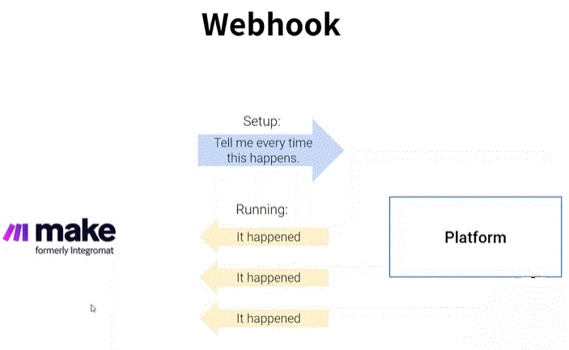

its a connection between two platforms. its basicely an aggrement, that is reciving notification every time it happen.

__* NOTE__ each webhook is for only one scenario.

__Registered Webhooks__ are the webhooks modules that __Make__ created.

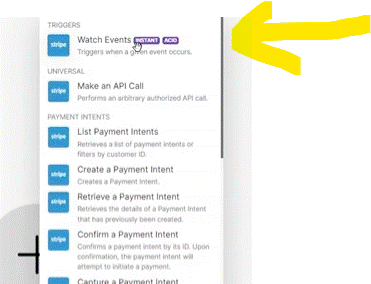

__Create manualy Webhook__ -  in case there isnt a moudle created or you need some extra options that are not in the Make module. 

The connection to the external webhook can be done (you generate the address or email on the cumsom webhook):
  * an Address to sent notifications
  * notifications sent by Email notification 

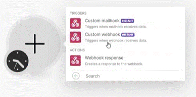

After the connection was done ther is a need to recive one notification in order to get the data structure (you can see the mark showing the structure was recived).

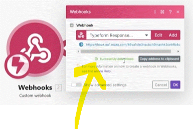

If we ever change what information comming throw (the webhook). we can re-generate the file structure by pressing "Redetermine data structure" and it will retrive the new 

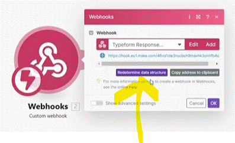

### Manage Webhooks

manageing __Webhooks__ is done under the main platform --> Webhooks. where you can see all webhooks you created.

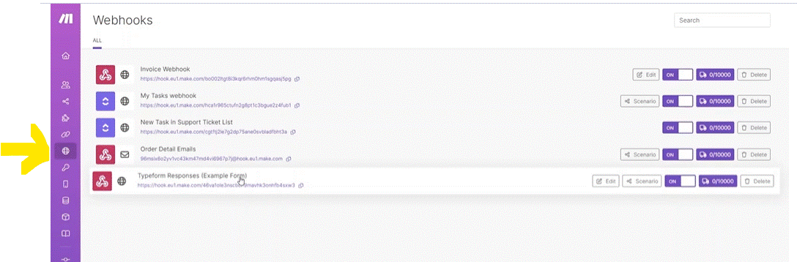

__LOGS__ - Inside a webhook (details) you ccan find the logs (3 days) of the information of what as come throw the webhook.

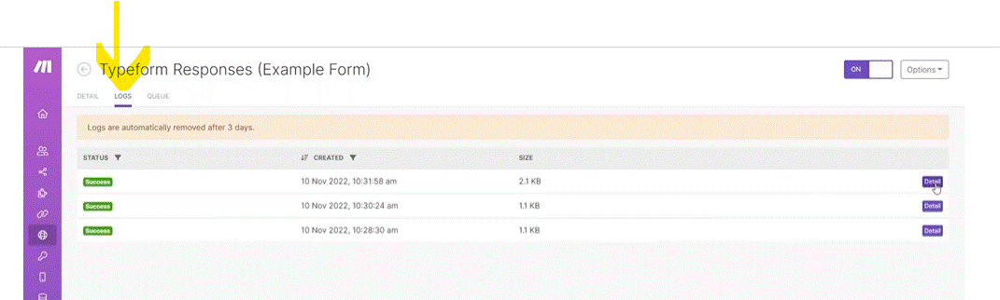

__Queue__ - Inside a webhook (details) you ccan find the "QUEUE". this is the un-process webhooks (in case the webhook is not running the information comming will be queued)

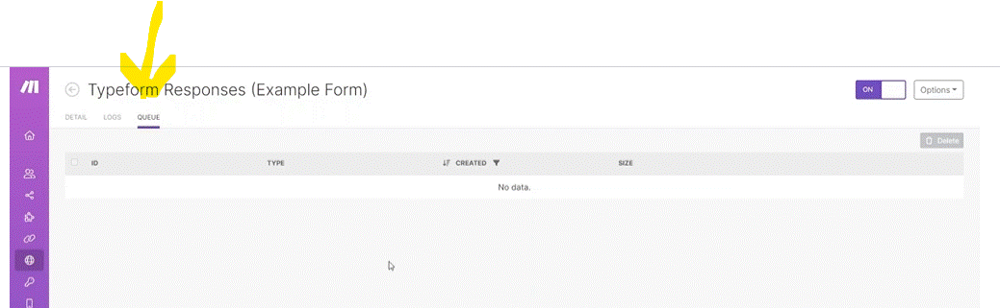

the amount of Queued that can be stored is showned in the webhooks page.

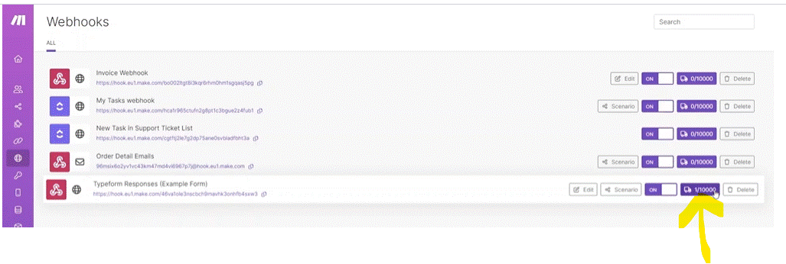

### schudule webhook connection

By default, webhooks are set to get information the moment it created. if you wish to schudule the retrive intervals you can do it by setting the webhook (what it will do is, the messages will com into the "QUEUE" and will be retrive (in the order they came on the intervals that being set).

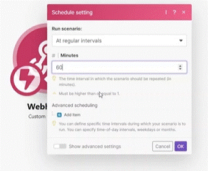

### Sequential processing

By default, Webhooks will process scenario in parallel (process the scenario as it recive it). in case you dont want the processes to run in parallel, you want them to precess them in the order they came or one in a time. you can set it;

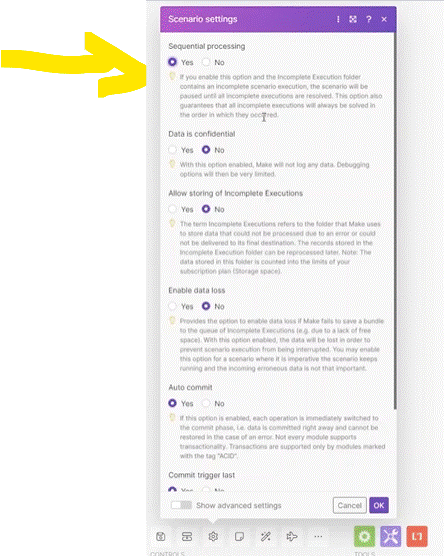

### Tip - executing another scenario

By using a HTTP module and a Webhook you can trigger another scenario (by setting the HTTP module to send to the webhook a message when trigger)

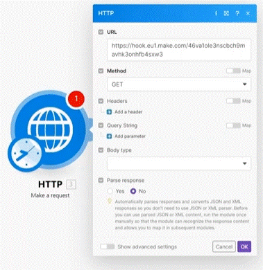

## Mailhooks

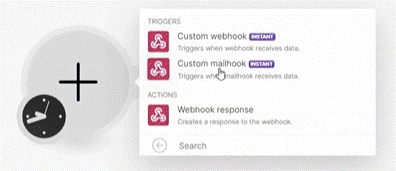

Mailhook is basicaly the same as webhook but insted using http over the net it use email.

it create an email addres for setting in the platform to send the massages to the mailhook and listen to the incoming email.

  
# [<-- BACK](l3introductiontoerrorhandeling.md) --- [NEXT -->](.md)

