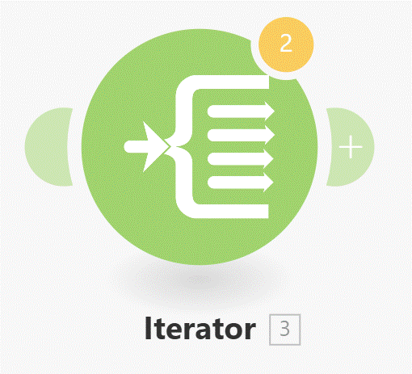

# Iterator

__Things to remember:__

1. The iterator is the key component when you need to individually process each item of an array.
2. Running an array through Iterator will always consume just 1 operation. The extra operations from iterator-produced bundles will be charged by modules after the Iterator.
3. Use Iterator to process array items individually and then Aggregator to put them back together.
4. Consider using a filter right after the Iterator if you need to process only some of the bundles coming from the Iterator. 
  

  
# [<-- BACK](l3arraygetmap.md) --- [NEXT -->](.md)

