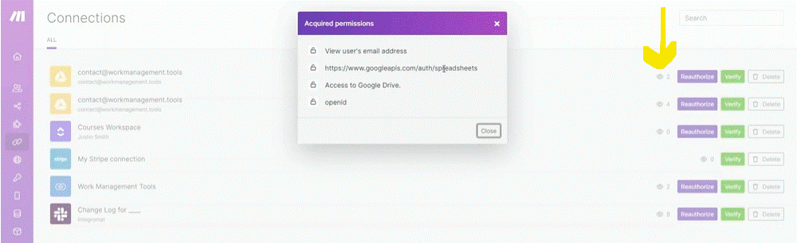
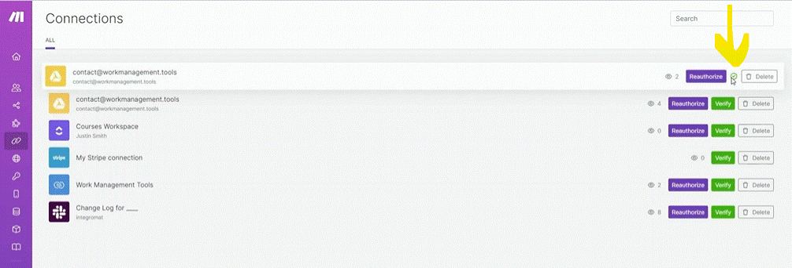
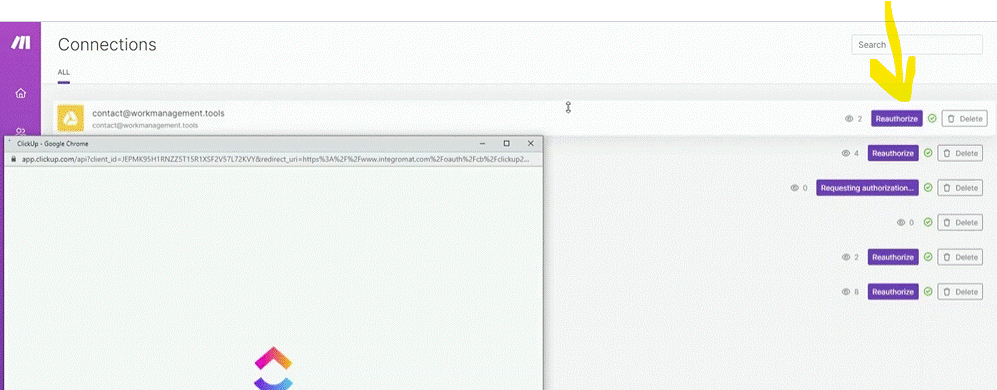
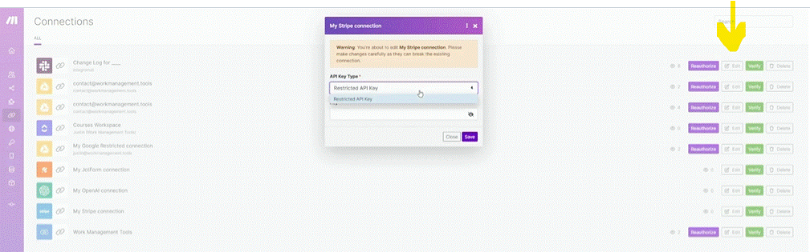
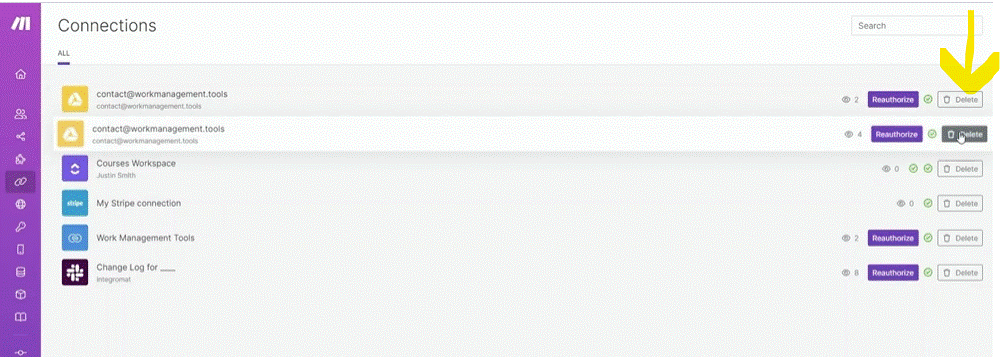

# Managing connections

__Things to remember:__

1. You can test existing connections by clicking the Verify button. For that, you need to navigate to the Connections menu and find the particular connection you need to test.
2. You can also reauthorize existing connections, but only those that support reauthorization flows = mostly OAuth 2.0 based connections where you login through your existing app account and approve Make to access the particular app.
3. Created connections are always bound to the team in which they were created. (Organizations on Free, Core and Pro plans have just 1 team.)
4. When setting up a scenario, only team members with the "Team Member" or "Team Admin" role can use existing connections within the team.
5. Some of the connections can be edited - typically, you will want to change your API keys or secrets without having to replace the connection in affected scenarios. This feature is currently being rolled out app by app and therefore some app connections may not be enabled yet but could be in future.

__* Note__  Created connections are always bound to the team in which they were created. (Organizations on Free, Core and Pro plans have just 1 team.)

## Connection page

### Connection right

You can see the connection permissins.

### Check the connection

You can check the connection (if you think you got an error) by pressing the "Varify" button.

### Reauthorize

If the connection is not working you can press "Reauthorize" and set the connection again (getting connection process).

__* Note__ Not every connection has a Reauthorize option. usuaky is because it autorize in a different way, like API or user name and password.  

### Edit

Some connection may have "Edit" button. it allw to change to other key types.

### Delete Connection

If your trying to clean thing up or we stop using a service or just manage the connection we can delete them on the "Delete" button.

__* IMPORTANT__ 
1. if your connection is lost and you need to create it again. you'l have to modify each scenario that used that connection.
2. because connection are both sides (Make and the provider (eg.gmail)). it can happen that the connection is broken from the provider side and not from the connection on __Make__.

  
# [<-- BACK](l3planningandbestpractices.md) --- [NEXT -->](l3intotoapiandhttp.md)

