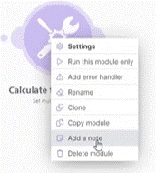
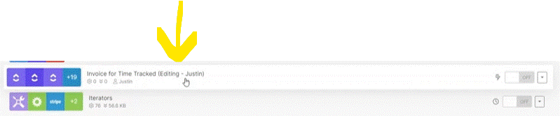
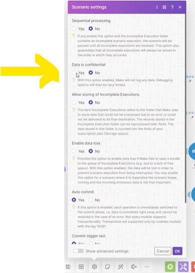

# Planning and best practices

__Things to remember:__

1. Naming. Give your scenarios, connections, webhooks, and folders clear and understandable names.
2. Use folders to group your scenarios.
3. Use labels above filters (can be usefull too for labeling the connection between the modules (without setting any filter)).
4. Use notes (allow you to add text to explain).

   
5. If the scenario is long and complex, it's recommended to create documentation describing the scenario word by word outside Make - for example in Jira, Confluence, or a Word document - anywhere where it fits your workflow.
6. Automatically “align” your scenarios.
7. Run each module individually when setting them up.
8. Test entire scenarios only with a small number of bundles.
9. If you are working with systems that keep no logs of changes, it’s always good to send yourself a Slack message or an email describing the changed items. It’s usually the very last module in the scenario. Alternatively, you can store these "events" in a Google Sheets spreadsheet for future reference.

__* IMPORTANT__ if two or more are working on the scenario. it will save the last man saving setting (delete the other changes made by the first save). to avoid this its suggested to add to the scenario name "Editing [name}"

### Confidential Data

In case you work with confidential data and you dont want it to be saved (on the platform - you wont the logs of the run). you can set it in scenario setting under "Data is confidential";

  
# [<-- BACK](l3introductiontowebhooks.md) --- [NEXT -->](.md)

