

# Real AI Use Case

__Things to remember:__

1. Be specific when providing instructions to AI.
2. Always check and test the outcomes produced - be ready to iterate your prompts multiple times until you start consistently getting expected results.
3. Whenever possible, instruct AI modules to return JSON structures back so you can easily map the outputs in the subsequent modules. Don't forget to turn on "Parse Response" option in the OpenAI>Create a Prompt module.
4. Keep in mind that the longer prompts you send to various AI tools (such as OpenAI), the more API credits you are going to pay to process the prompt. The similar applies to outputs of the prompts - the longer the output is, the more costly it's going to be.
5. In case you are going to build a similar use case, you will need to get Gmail label IDs so you can later map them in the "Labels to add" field in Modify Email Labels module. The most elegant approach is to simply open this module and select a label for which you need the ID and then turn on the mapping as shown below. This will tell you what the ID for each label value is.

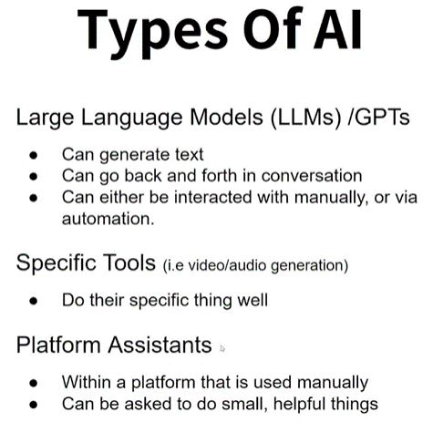

On this example we going only to use the LLM model (other will be explain later).

In this example, we ceating an authomation for getting email and classify them and also create a draft email for response (it use __ClickUp__ Labels for the prioetizing of the Email (modules 2-4)).

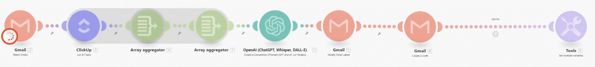

__module 1__ - Gmail (Watch Emails)

first module in our scenario. setting the module to watch for incoming Emails.

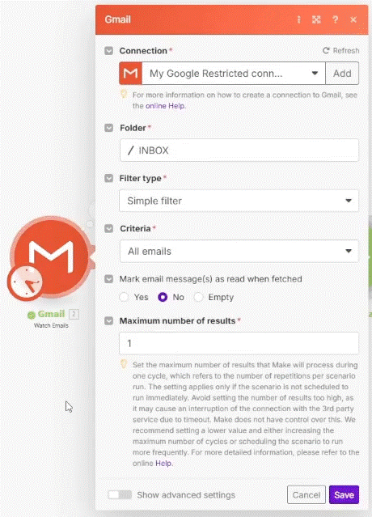

__module 2__ (optional)

for retriving Labels for the AI to classify the Emails.

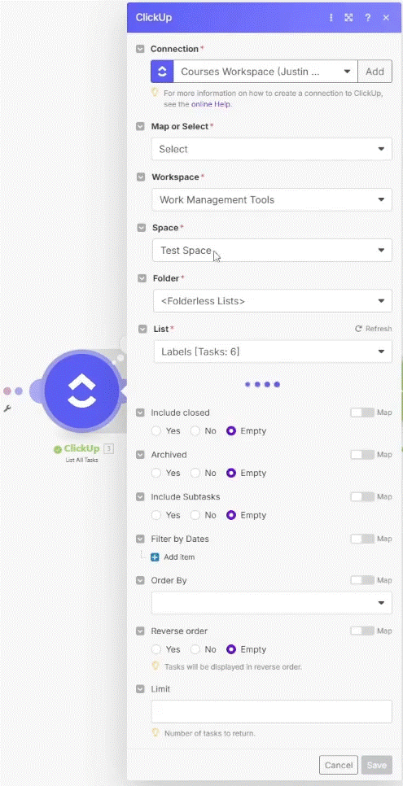

__module 3__ 

An Array aggregation module for combining the task (rioretize Labels) into a boundle (it create two array's - Task name (Label) and the Gmail Label ID).

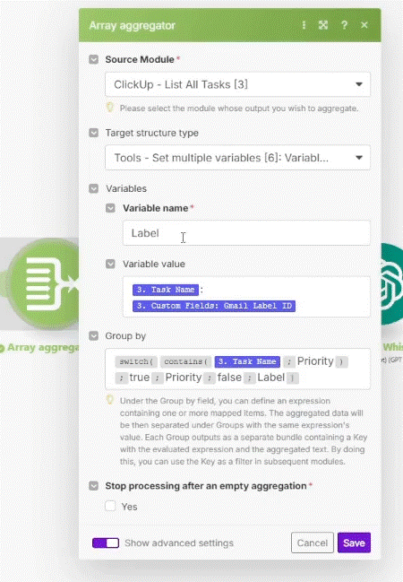

__module 4__

Another array that combine the two arrays created in the privious module into one (Task name (Label) and the Gmail Label ID).

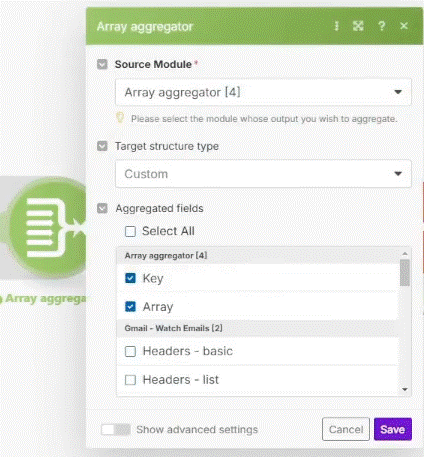

__module 5__ OpenAI (Create a Completion (Prompt))

We add an OpenAI (Create a Completion (Prompt) as a second module in the scenario where we set the module for specific roles we need (priorities the email and writing a draft response.

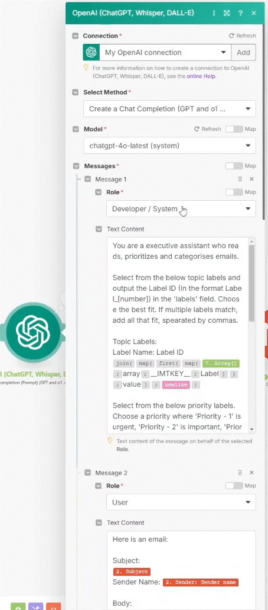

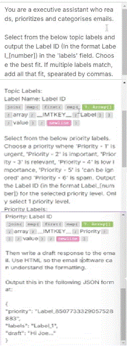

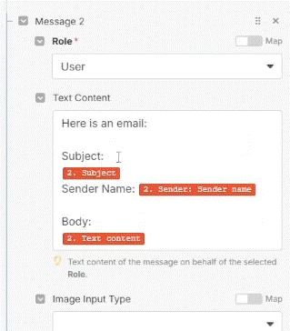

under the __Advance__ setting we change the respose format to __JSON Object__ under __"Response Format"__ and also __Yes__ in the __Parse JSON Response__

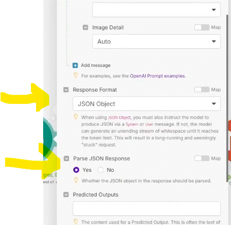

__* Note__ there are Advance setting. is good to look over to see if there is something usefull.

__module 6__ Gmail (Modify Email Lables)

__module 7__ Gmail (Create a Draft)

Creating the __Draft__

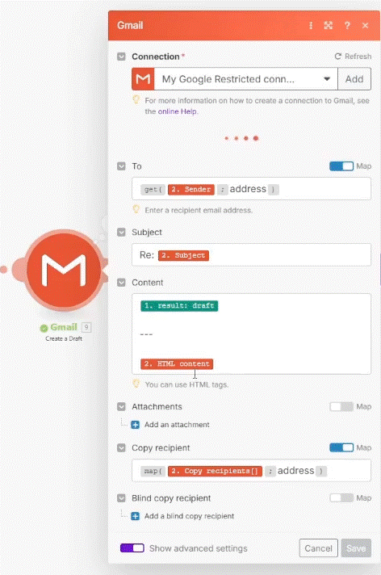

__Filter__ we creaed a "NEVER" filter (between module 7 and 8)

it will __NEVER__ run (the condition is set to if 1 equal to 2 (which is allways wrong).

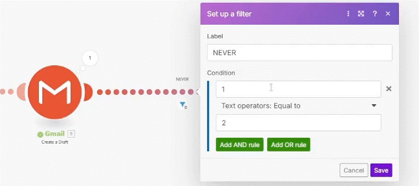

__module 8__ Tool (Set multiple variables)

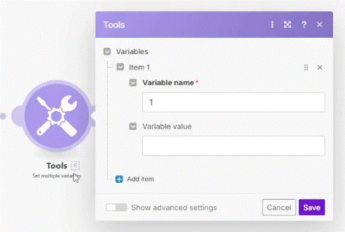

(you must open the Variables in the __Tools__ module in order to activate the array connection)

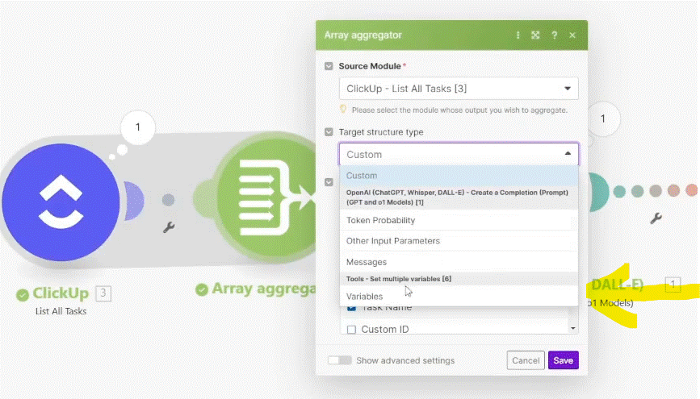

  
# [<-- BACK](l3gettinghelp.md) --- [NEXT -->](.md)

