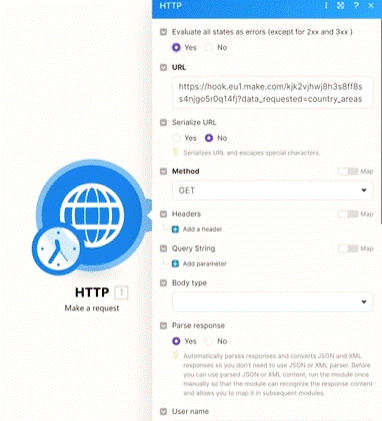
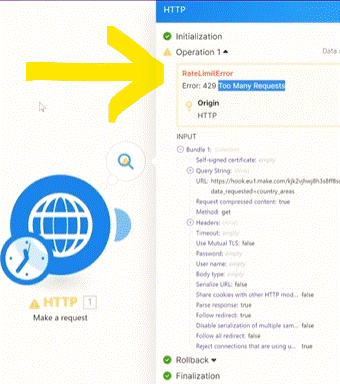
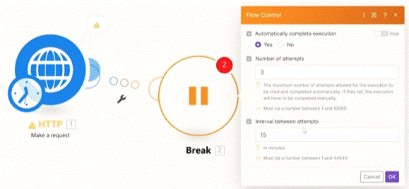

# Advanced Erro Handling

   
__Things to remember:__

1. Most of the APIs have limits and will eventually fail.
2. Getting errors from time to time is a relatively normal situation - treat the error as information!
3. Error handling directive = error handling modules. It's the same thing.
4. Generally speaking, you should be mainly using __Break, Resume, Ignore__ (and in this order).
5. __Commit__ and __Rollback__ directives are tricky because they are only supported by ACID-labeled modules. If you have a scenario with ACID and non-ACID modules (which is normal), you may e.g. rollback only ACID modules and not the non-ACID modules, which is probably not desired.
6. If you are OK with ignoring a failing module, you can simply use __Ignore__ module to do so and the scenario execution will end up as a success.
   1. Beware that you can miss important errors which should not be skipped- As a result, you will not learn about the errors unless you visit the scenario and go through its past executions. Advice: Use __Ignore__ only when you know what you are doing.
   2. There are 2 instances when you can consider using Ignore in error handling:
      1. You just don't care about a failing module at all.
      2. You don't want your scenario to ever get disabled because of a failure on a particular module.

   3. Keep in mind that when an error from a module is ignored, subsequent modules in the scenario will not be executed anymore in the "current run" as shown in the overview table below.
      
7. Most of the time, it's OK to just use __Break__ with a certain number of retries - this approach resolves 99% of the issues.
   1. However, a break may not always be the best option because, at the very least, you will always need to wait for at least 1 minute before retrying. In many APIs, it's good enough to just wait a few seconds before retrying without having to wait for a minute.
   2. Waiting for 1 minute (or more) may not be a problem in smaller scenarios but having multiple 1-minute "wait" instances in a bigger scenario can cause the scenario to run out of time.
   
8. If __Break__ is not the best solution for you, you can always use __Resume__ which allows you to build a customized solution (where you can wait just for 1 second for example).
9. We should also not forget to __build error handling without official error handling directives.__ How? You can simply right-click any module > Add error handler > Add any module from any app on Make :)
10. You can also create error handling within error handling. The sky is the limit.

__Error handling overview:__

There are so many advanced error handling options, right? That's why we've summarized them for you in the table below (right-click the image and open it in a new tab to see it in full size):

## how to handle 429 errors (aka "Too many requests") which are common in many APIs/apps.

__Try yourself:__
Spoiler alert: you "may" need this in the near future :)
1. Get country areas with our HTTP app.
2. Identify when the 429 error happens.
3. Mirror Manuel's solution to reliably get around the error.
4. Enjoy the stable scenario with no more failures!

### Example Case for Error handling

we going to create a simple scenario witch will create a erro haning scenario. we are going to use the __Resume__ module to handle the error. by adding a __Sleep__ moudle (it will wait few seconds to pass after the 50 seconds limit). Then we will quiery again (Using HTTP module (same as the original (we copy it)) to retrive the data and the __Resume__ will return the values extracted and continue the main scenario).

__module 1 - Http (Make a request)__

this moudle pull the datd and will create an error  (this link is set to fail and return an error code ( __error 429__) if the request is done after 50 seconds on the time (clock). and if the time is below 50 seconds, then it will work just fine). :

Sample data containing country areas is here:

  https://hook.eu1.make.com/kjk2vjhwj8h3s8ff8ss4njgo5r0q14fj?data_requested=country_areas

 

 here is example of an error run (we run the module after the 50 second time on the clock):

  

In this case we know we have to wait 10seconds in order to be able to try this call again. and that is should work (it will pass the 50 seconds frame).

__There are multiple ways to use error handling:__

Rollback, Breack, Resume, Commit and Ignore. 

  

### using Break

In Most cases, it suggested to use the __Break__ erro handler. It tryes multiple times to solve the issue. where you can set the interval between requests (for our purpose it wont suit because the intervals are in minuts and it will come again after the 50 seconds time (if the first run after the 50 seconds time) - we need to wait in seconds (like 10 to pass the 50 seconds barrior)).

  

(if you need to turn on the incompete executions in the scemario. its done under "scenario settings" and check "yes" on teh "Allow storing of incompete Executions")

### using Resume

__Resume__ will continue with whatever we put in between and then continue as if this source moudle break.

we add an error handling moudle to the main HTTP moudle (so will have the error handle route). then in between we added a sleep moudle (for waiting 10 seconds). and a copy of the main HTTP mmoudle for retriving the data. And finely the resume that will continue with the main scenario.

__Add in between - creating the fix error scenario__

__Sleep Moudle__

This will set to wait 10 seconds for that the error limit time will pass.

Simple __Copy__ and __Paste__ the same module of the HTTP to GET the data (that wasnt pull on the first module that activated the error handle route)

Setting up the __Resume__ moudle to return the varibales (values) that wherent pulled because of the error.

Now...it will go through the first module (HTTP). If it fails (it will follow the error handler route), it will wait 10 seconds (Sleep module), then retry the exact same module again (HTTP module) and then pass the output data of our retried module back into our original route. and continue the scenario.

for the example we added a __Iterator__ to deal with the data.

__* Note__

you can go even further down and add more error handler paths to it (there is no limit).

## Using Ignore

if you use __Ignore__ handler and it fails, it will simple stop at this position (HTTP module) and not continue to the rest of the scenario. in this case it wont fit (the scenario wont be full executed).

## Common HTTP status Code

https://en.wikipedia.org/wiki/List_of_HTTP_status_codes

most common ones are;

__404 Not Found__ - means that some parameters you have passed or the URL is not correct.

__429 To many Requests__ - to many requests in a given amount of time (this error is the one we handle in the example).

__5xx Errors__ - thoese are server errors. usualy it can be solved by using breack error handler (the issue is with the end side and it usualy temporary and after a while we can ry again) so simple waiting for some time (like 5 mn) and trying again, usualy solves these kind of errors.

  
# [<-- BACK](l4complexifformulas.md) --- [NEXT -->](l4.md)

