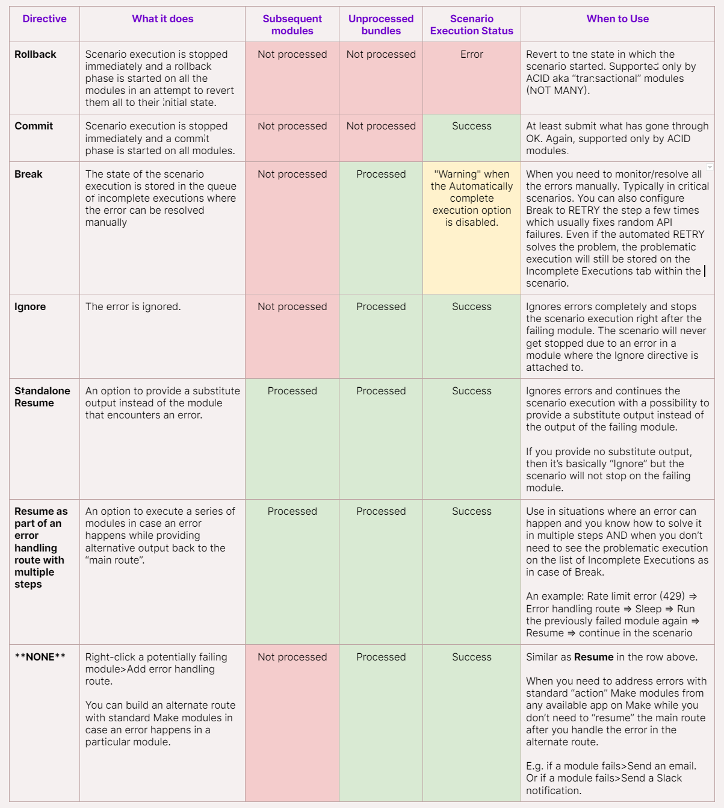

# Complex IF Formulas

## how to handle 429 errors (aka "Too many requests") which are common in many APIs/apps.

Sample data containing country areas is here:

  https://hook.eu1.make.com/kjk2vjhwj8h3s8ff8ss4njgo5r0q14fj?data_requested=country_areas

__Try yourself:__
Spoiler alert: you "may" need this in the near future :)
1. Get country areas with our HTTP app.
2. Identify when the 429 error happens.
3. Mirror Manuel's solution to reliably get around the error.
4. Enjoy the stable scenario with no more failures!

   
__Things to remember:__

1. Most of the APIs have limits and will eventually fail.
2. Getting errors from time to time is a relatively normal situation - treat the error as information!
3. Error handling directive = error handling modules. It's the same thing.
4. Generally speaking, you should be mainly using __Break, Resume, Ignore__ (and in this order).
5. __Commit__ and __Rollback__ directives are tricky because they are only supported by ACID-labeled modules. If you have a scenario with ACID and non-ACID modules (which is normal), you may e.g. rollback only ACID modules and not the non-ACID modules, which is probably not desired.
6. If you are OK with ignoring a failing module, you can simply use __Ignore__ module to do so and the scenario execution will end up as a success.
   1. Beware that you can miss important errors which should not be skipped- As a result, you will not learn about the errors unless you visit the scenario and go through its past executions. Advice: Use __Ignore__ only when you know what you are doing.
   2. There are 2 instances when you can consider using Ignore in error handling:
      1. You just don't care about a failing module at all.
      2. You don't want your scenario to ever get disabled because of a failure on a particular module.

   3. Keep in mind that when an error from a module is ignored, subsequent modules in the scenario will not be executed anymore in the "current run" as shown in the overview table below.
      
7. Most of the time, it's OK to just use __Break__ with a certain number of retries - this approach resolves 99% of the issues.
   1. However, a break may not always be the best option because, at the very least, you will always need to wait for at least 1 minute before retrying. In many APIs, it's good enough to just wait a few seconds before retrying without having to wait for a minute.
   2. Waiting for 1 minute (or more) may not be a problem in smaller scenarios but having multiple 1-minute "wait" instances in a bigger scenario can cause the scenario to run out of time.
   
8. If __Break__ is not the best solution for you, you can always use __Resume__ which allows you to build a customized solution (where you can wait just for 1 second for example).
9. We should also not forget to __build error handling without official error handling directives.__ How? You can simply right-click any module > Add error handler > Add any module from any app on Make :)
10. You can also create error handling within error handling. The sky is the limit.

__Error handling overview:__

There are so many advanced error handling options, right? That's why we've summarized them for you in the table below (right-click the image and open it in a new tab to see it in full size):

  
# [<-- BACK](l4complexifformulas.md) --- [NEXT -->](l4.md)

