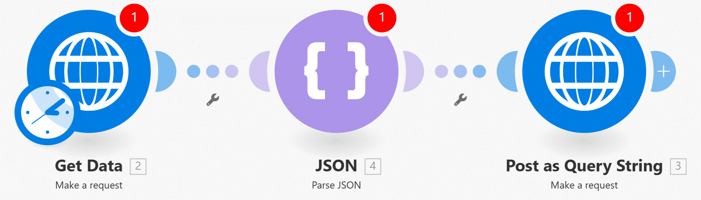

# Webhooks for Advanced

   
__Things to remember:__

This will introduce some of the lesser-known tips and tricks which you can use when working with webhooks in Make.

Sample data used:
https://hook.eu1.make.com/kjk2vjhwj8h3s8ff8ss4njgo5r0q14fj?data_requested=country_list&page=page_1

__Try yourself:__

1. Get the country list data via the HTTP app.
2. Follow Manuel in building a webpage returning the first page of our country list.
3. Would you ever have guessed you would be using Make to build web pages?
   
__Things to remember:__

1. Understand the differences between having your webhooks ON/OFF and having scenarios using webhooks ON/OFF! If you want to be sure that Make will __not reject__ any incoming payloads, your webhook status must be __ON__ and the webhook queue cannot be full!
2. Sometimes you may need to prevent Make from parsing the incoming webhook payloads - you can do that by going to webhook's advanced settings and setting the __JSON pass-through__ option to __YES__
3. When using webhooks together with HTTP app, you can use Make to "forward" data to a different webhook.
   * Data can be forwarded as JSON payloads
   * Data can be forwarded in query strings
   * Data can be forwarded even as __files__ - you will need to use __Multipart/form-data__ as __Body type__
     
4. By taking the forwarding concept to the next level, you can use the schema below to introduce __multiple real-time triggers into your workflow__. Your scenario "listeners" would be representing "multiple triggers" and they would simply forward the incoming payloads to the "master scenario" with would process the main business logic:

5. You can even use webhooks to __build simple web pages with Make__ if you know HTML. Again, our goal is not to teach you HTML from scratch (there are free many courses for that) but we want you to be inspired by our simple use case. For this trick to work, your scenario should contain the following:
    1. Webhooks>Custom webhook is the first module
    2. Your main logic compiling dynamic parts of your HTML
    3. Webhooks>Webhook response as the last module presenting the compiled HTML back to the user

=> All you need to do at the end is to visit the webhook URL in your browser and the browser will turn your compiled HTML code into a webpage.

__NOTE__

1. A scenario turned off is not a problem, the incoming payload will be saved into the queue. but if the __Webhook__ is __turn OFF__ then the payload will be rejected and will not be queued (youll get Error 400 - Bad Request)

Make sure the webhook is turn on so the payload wont be lost and rejected.

2. pass the data in a Webhook as __JSON__ (get the data in row JSON).

## Post dada to Webhook from another mix area (example)

### 1. Forwarding to a webhook

Retrive data from web page using HTTP Make request module

Post the Request to the Webhook URL.

### 2. Forwarding Query string to another scenario

will need to parse the data first  and pass it throw.

* first module is like setting are the same as the first example above.

Setting the data into a JSON

Paste it as a __Query String__

### 3. Forwarding Data (files) using make request

if we want to send files o somebody else. we can set under body type on the HTTP (make request module) to __"Multipart/form-data"__

### 4. Using multiple Triggers in one scenario

using multiple triggers is not posible. a way to workaround. create mutliple scenario for each trigger. and use an __HTTP__ mudule to pull the data to the main scenario (we do it for each trigger we want).

on the example shoed here we added a __"trigger"__ value so that the main scenario could identify the source that send the trigger.

On the main scenario we can defind the source by the trigger and set it to the scenrio we wish.

## Simple page with Webhooks response

Recive the webhook just as normal, getting the data.

Then we iterating the date through the iterartor. creates a dynamic table of the data.

Set the Text in in the form needed (HTML) by using __Text aggregator__.

Webhook responce. final step of the scenario. you can put some set the page (tags, table, header etc').

  
# [<-- BACK](l4advancederrorhandling.md) --- [NEXT -->](l4.md)

