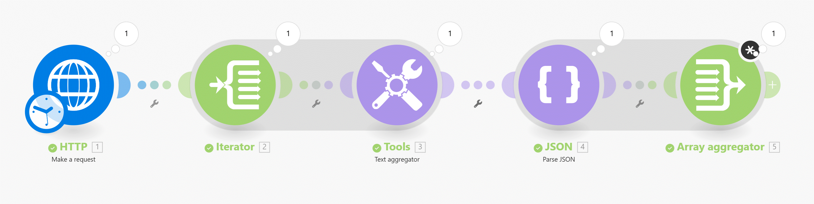
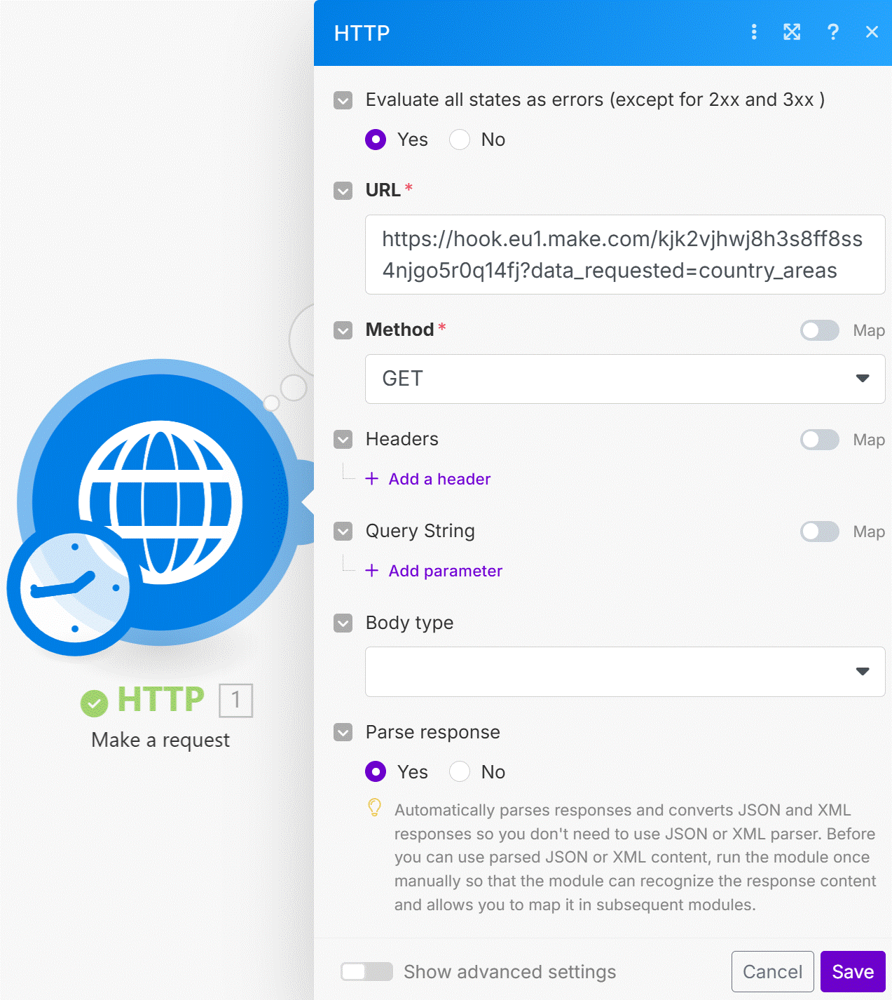
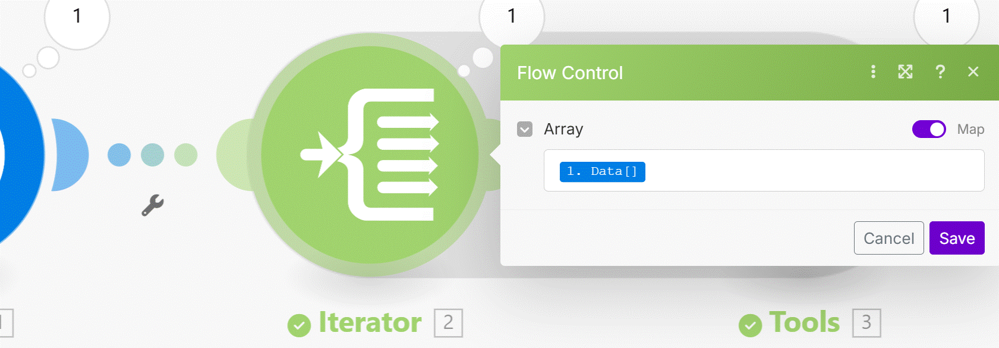
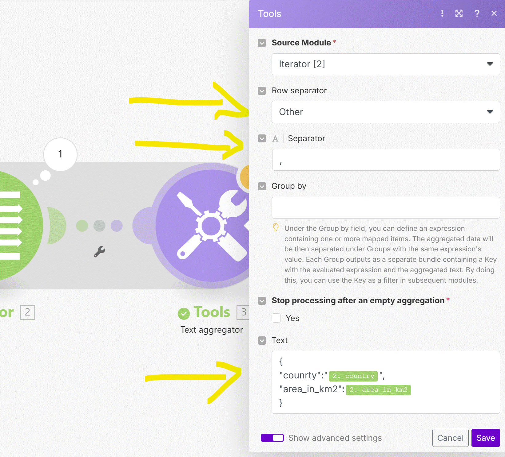
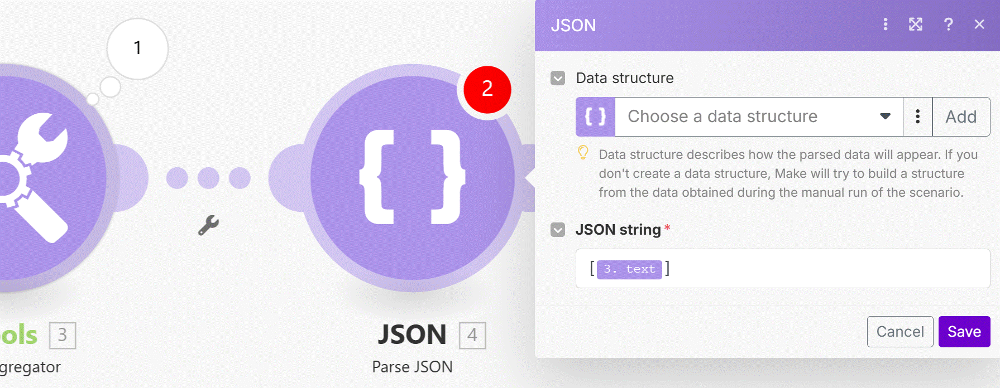
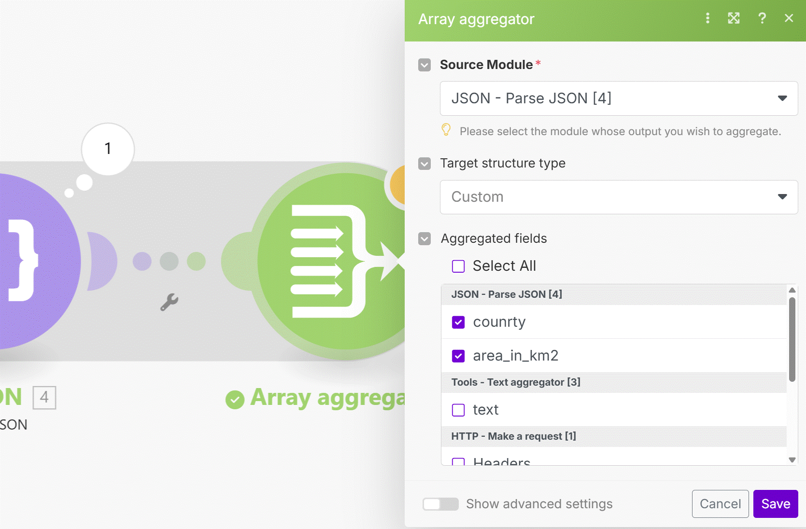
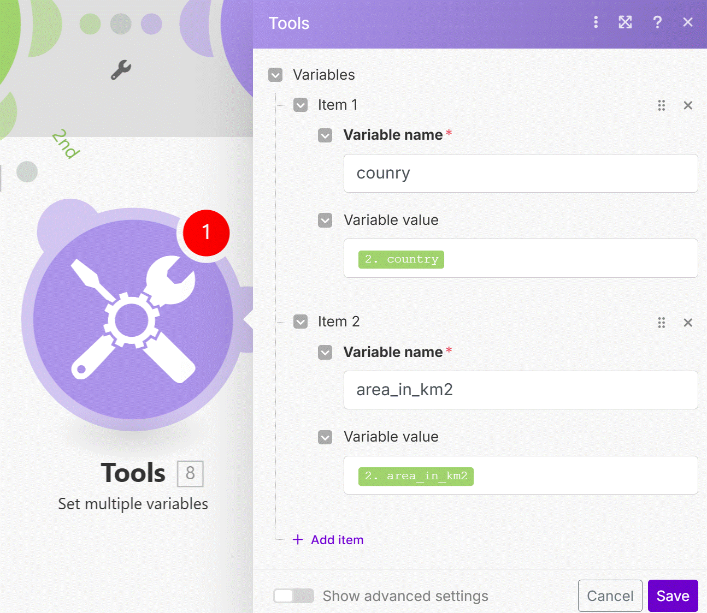
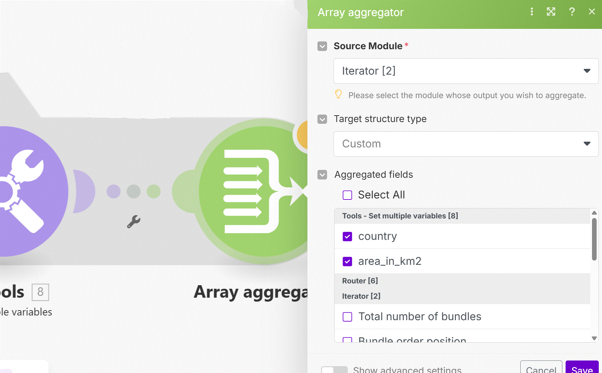
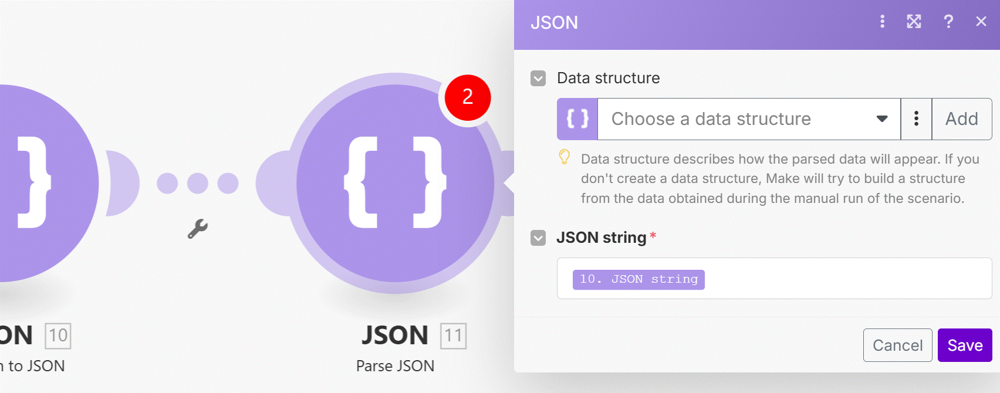

# How to get missing items to show in Array Aggragator

Have you ever been in a situation where the Array Aggregator would not show all the possible items for aggregation? Let us show you 3 tricks to solve this problem in this short but powerful lesson.

Sample country areas data is here: 
https://hook.eu1.make.com/kjk2vjhwj8h3s8ff8ss4njgo5r0q14fj?data_requested=country_areas

__Try yourself:__

1. Get the data via the HTTP app.
2. Iterate through Data[] array coming from the HTTP module and add the Array Aggregator right after the Iterator.
3. You will see that __country__ and __area_in_km2__ will not be offered in the Array Aggregator for aggregation.
4. Try out Manuel's three tricks to solve this problem.

   
__Things to remember:__

1. Sooner or later, you will in a situation where an Array Aggregator does not show all the items supposedly coming from the preceding module. This can happen because incoming data structures are not "well known" to Make.
2. You can use three different solutions to cope with the problem:
  1. You can try to build your own __JSON via Text Aggregator__ and then use the Parse JSON module. Then Array Aggregator will see all the items coming from the Parse JSON module. This method can get tricky when your JSON has many nested arrays or collections. Another issue arises when your values contain reserved JSON characters such as " or \. Then you must escape the characters otherwise the generated JSON string would not be valid and would not pass through the Parse JSON module.
  2. You can __Set Multiple Variables__, map your values into variables and only then add Array Aggregator which will "see" the newly set variables. This method is relatively simple and easy to understand but the downside is that it can potentially consume a lot of operations in case you are aggregating many bundles.
  3. The most elegant method is simply to use __JSON>Transform to JSON__ module to convert your input object to a JSON (most of the time the object is an array or a collection), then use Parse JSON, and then use Array Aggregator to aggregate the values coming from the preceding Parse JSON module.

## 1. Using Text aggregator 

Using __Text aggragator__ to create a dynamic __JSON__ structure and then parsing it afterwards.

  

__HTTP (make request) module__

This module retrives the data to be handle.

  

__Iterator__

iterate each line of data from he source (HTTP module).

  

__Tools module (Text aggragator)__

Take the data and convert it to a JSON structure.

  

__JSON (parse JSON) module__

This module aggragate the JSON into one file (bundle).

  

__Array aggragator module__

Here we arrange the JSON file back to an __Array__.

  

  ## 2. Another option - Using Set multiple variables module

  First 2 modules are the same as the example above. this option will consume many operations beacuse it create a bundle for each item in the iterator.

  we add a Module Tools (Set multiple variables) and map the field we want.

__Tools (Set multiple variables) module__

    

__Array aggragate module__

Arranging the data into one array.

    

## 2. Another option - Using JSON module (Transform to JSON) moudle (this one is the easy way)

we use only the first module (HTTP) like before. 

    

Then we use the parse JSON modle to pass the data to an Array aggregator in order to combine it back to an Array.

    

    
   

# [<-- BACK](l4datastore.md) --- [NEXT -->](l4arrayoperations.md)

