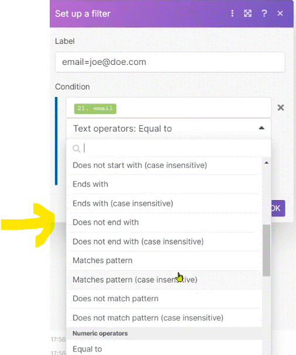

# Common Mistakes to Avoid (part 1)

Here we'll identify common mistakes which we frequently see happening and we'll provide tips on how to avoid them.

Sample data used in this video: 
https://hook.eu1.make.com/mvoybmpjdjj4qbillvv6aasorypv811c

__Things to remember:__

1. If you are using multiple modules from the same app within your scenario and you map the same item names from the app in multiple subsequent modules, make sure you __map the items from the correct module IDs__.
2. If you are mapping arrays, there is a high chance you should __iterate__ through the array first.
3. When moving a module with an associated filter to the beginning of your scenario, you should remove the filter first otherwise your first scenario execution will end up with an error. Alternatively, you can add a new temporary module on the first position in the scenario and link the temporary one with the rest of the scenario, remove the unwanted filter, and then remove the temporary module.
4. Order of routes matters! What you see may not always be what you get - make sure to __align__ your complicated scenarios to truly understand which route gets executed and when.
5. When setting up filters, make sure to select the __correct operators for the correct data types__.

# Commoin mistakes

## 1. mapping Correct variables

when you map somthing. you can mismap some variables (ex from another module that has the same name).

Example for that: 

here we set two tolls (Set variables) with the same variable name but with different value. on the third module we want to get the value frm the first ( because they have the same name. we mite mistakely chouse the wrong field)

     

__* Note__
it is __NOT__ only to pay attention only to the __Names__ of the variable withing the mapping. it's extremely important to also pay attention to the module ID's within those variable (to ensure the correct value you want).

## 2. Iterate or Not Iterate?

users are incorrectly mapping item which are nested in an array.

     

The problem occure if the value is in an __Array__ (youll get only the first array (unless you specify the array number))

     

In case you want all the values in the Array you have to add a __Iterator__. the scenario should look like:

     

## 3. Invisible Filters

In case, for example, you copy a module which has a filter before him (filters are associated to the first module behind them) to the __First__ step of the scenario. you wont see the filter before it (but it has been copy with it). you'll get an Error like this (on running the scenario):

     

The issue here is that there is a filter associated with the first module, we just don't see it.

In Order to see the __Filter__. we can associate a module before it and see the filter (remove the filter if you need).

     
   
## 4. Order of Routes behind Router

Implications of not setting the route order correctly.

On this example we creating a scenario that looks at the student and find the oldest and the yangest students.

     

If you change the order of the route the scenario will not run correctly!!!

__* Importent__ 
If you unlink a module and __link__ it back it will asume the last step in the route (ignoring the order is viewed).
1. To Avoid it - Use the __Align Scenario__ button to set the right order (viewed)

      
   
2. __Right click__ the router --> __Order routes__

      

## 5. Data Types in Filters

A common mistake is having the correct data type set in the filters.

On this example we set a scenario that extract the student by using iterator's and filter __ONLY__ a specific __Email__ (using filter) and extracting the name (Set variable module).

A Common Mistake is chousing the wrong operation(like math opration to filter a text variable)

      
    

# [<-- BACK](l4makedevtool.md) --- [NEXT -->](l4commonmistakes2.md)

