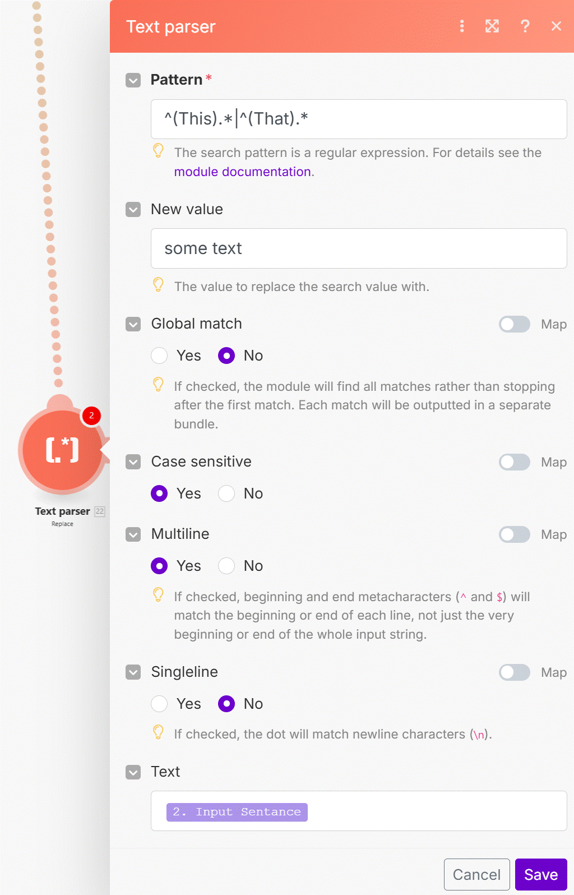

# Make DevTool

Here we'll identify common mistakes which we frequently see happening and we'll provide tips on how to avoid them.

Sample data used in this video: 
https://hook.eu1.make.com/mvoybmpjdjj4qbillvv6aasorypv811c

__Things to remember:__

1. If you are using multiple modules from the same app within your scenario and you map the same item names from the app in multiple subsequent modules, make sure you __map the items from the correct module IDs__.
2. If you are mapping arrays, there is a high chance you should __iterate__ through the array first.
3. When moving a module with an associated filter to the beginning of your scenario, you should remove the filter first otherwise your first scenario execution will end up with an error. Alternatively, you can add a new temporary module on the first position in the scenario and link the temporary one with the rest of the scenario, remove the unwanted filter, and then remove the temporary module.
4. Order of routes matters! What you see may not always be what you get - make sure to __align__ your complicated scenarios to truly understand which route gets executed and when.
5. When setting up filters, make sure to select the __correct operators for the correct data types__.

     

   

# [<-- BACK](l4makedevtool.md) --- [NEXT -->](l4commonmistakes2.md)

