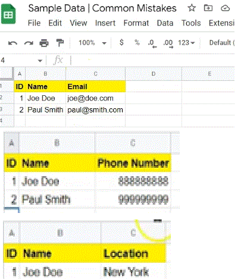
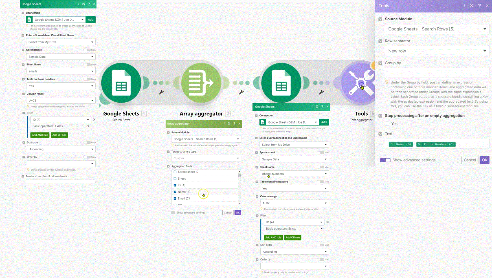
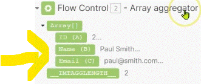
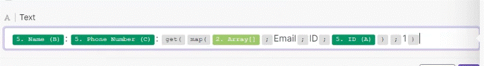
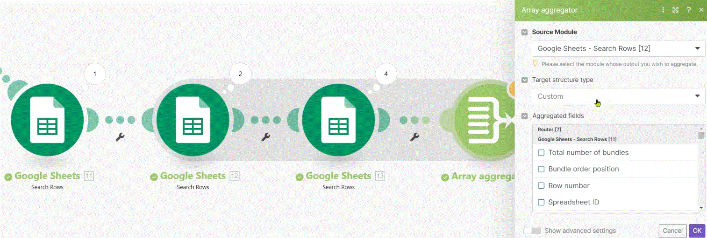

# Common Mistakes to Avoid (part 2)

This is the second part of common mistakes to avoid. How many of the discussed mistakes have you already faced yourself?

__Things to remember:__

1. When using the map(...) function, always enter the __raw names__ into the function's arguments.
2. Using another Search (or List) module after a Search (or List) module with no filter will likely results in a very high number of __bundles growing exponentially__ - if you are having a series of such modules behind each other, you should probably limit your Search (List) modules to retrieve a max number of results (e.g. 1) or possibly use an aggregator after the first Search (List) module.
3. When using aggregators, make sure to select the __correct Source Module for the aggregation__ - especially if you are using modules with the same names in front of the aggregator, you can identify the modules by their IDs (again).
4. Don't forget to __document your solutions!__ You will save yourself (or your team) a lot of trouble in the future.
5. It's always a good idea to __disable routes that you don't need__ to work with during the development phase.

# Common mistakes

## 1. Using Correct Raw Names Inside Functions

For the Example we set a scenario where it relay on simple __Google sheet__ with 3 tabs (first tab with email, second with phone number, and third with email)

The Issue we are demostrating is wrong use with "__get( Map....))__" function. __Use the row Name__ and not the __displayed name__

__Wrong way to write__

__Write way to write (using "Raw name")__

## 2. Too Many Search Modules

Common mistake is that users use search modules behaind each other. and what that means is that the bundles will grow exponentially, because the results will be just multiplying each other. 

To avoid multilpe bundels you can:
1. use only one search (use the first result)
2. use an aggragation module behind it (either Array aggragation, Text aggragation or Numeric Aggragator)

## 3. Choosing Correct Source Module for Aggregations

Choosing the right level of aggragatoion.

Once you decide to do an aggragation, it's important to understand which module is suppsed to be the source for your aggragation. so that you get the correct granularity within your aggragation.

## 4. Documentation

Important thing which is very frequently missing in many organizations is __Documentation__. if you are building a complex scenario which are involving multiple departments, multiple apps, multiple modules. you should be always documenting them for users of the organization. so people in the organization could understand the scenario.

__it can be done:__
  * on word document.
  * JIRA
  * monday
  * clickup
  * or any other tools.

__make sure:__
  * you describe the scenarios.
  * describe the tricky part of the scenario - the most complicated parts that myte be hard to remember when you come back to the scenario after.
  * describe what the scenario is doing
  * what are the inputs
  * what are the outputs
  * maybe even....describe potential modules which can eventually fail
  * 

# [<-- BACK](l4commonmistakes1.md) --- [NEXT -->](l4.md)

