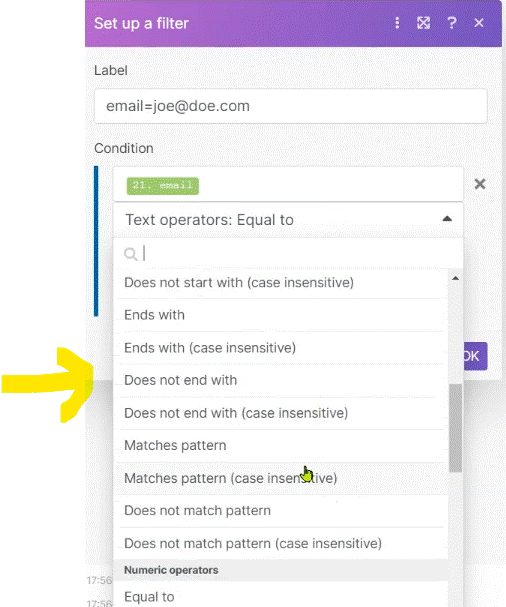

# Common Mistakes to Avoid (part 2)

This is the second part of common mistakes to avoid. How many of the discussed mistakes have you already faced yourself?

__Things to remember:__

1. When using the map(...) function, always enter the __raw names__ into the function's arguments.
2. Using another Search (or List) module after a Search (or List) module with no filter will likely results in a very high number of __bundles growing exponentially__ - if you are having a series of such modules behind each other, you should probably limit your Search (List) modules to retrieve a max number of results (e.g. 1) or possibly use an aggregator after the first Search (List) module.
3. When using aggregators, make sure to select the __correct Source Module for the aggregation__ - especially if you are using modules with the same names in front of the aggregator, you can identify the modules by their IDs (again).
4. Don't forget to __document your solutions!__ You will save yourself (or your team) a lot of trouble in the future.
5. It's always a good idea to __disable routes that you don't need__ to work with during the development phase.

      
    

# [<-- BACK](l4commonmistakes1.md) --- [NEXT -->](l4.md)

