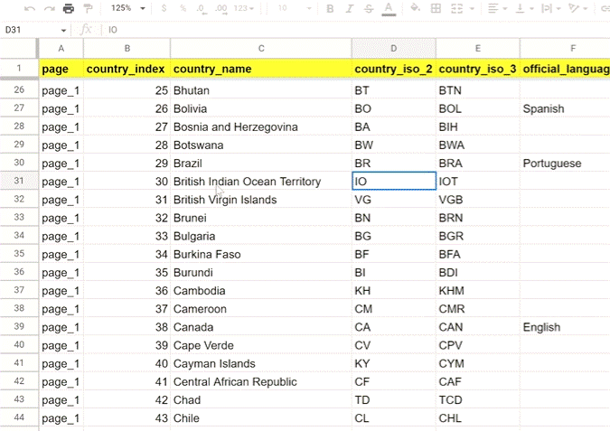
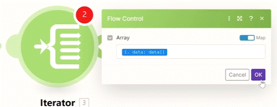
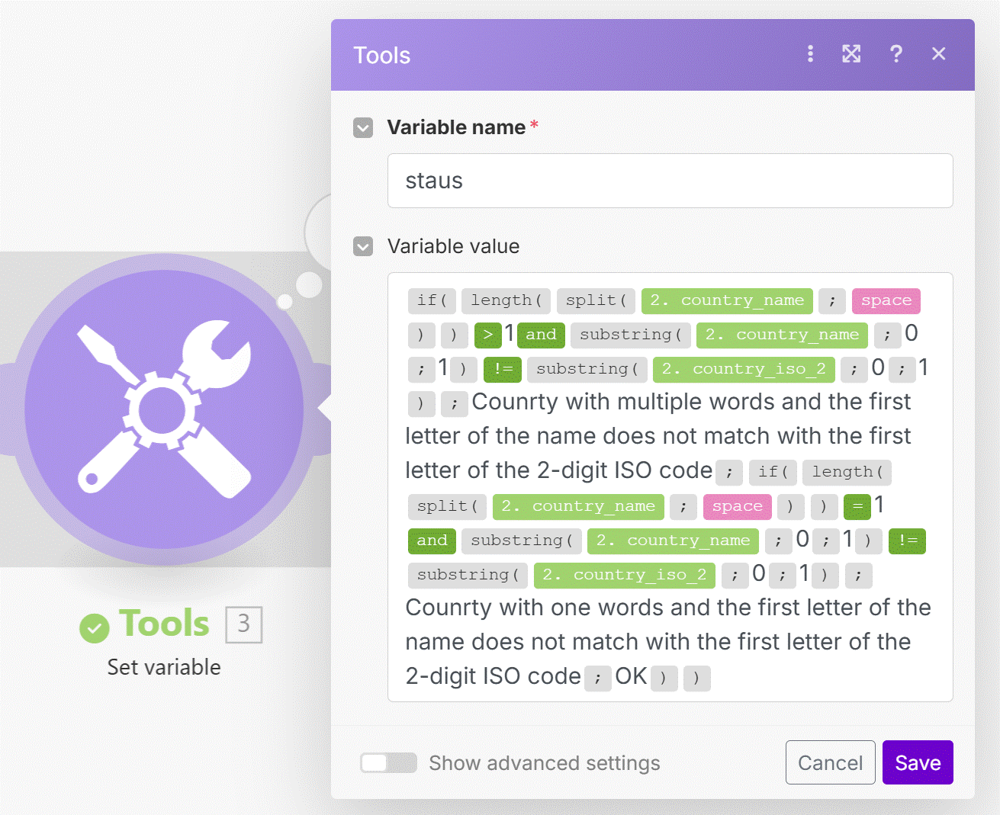
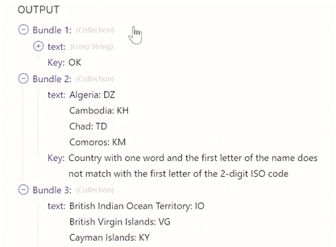
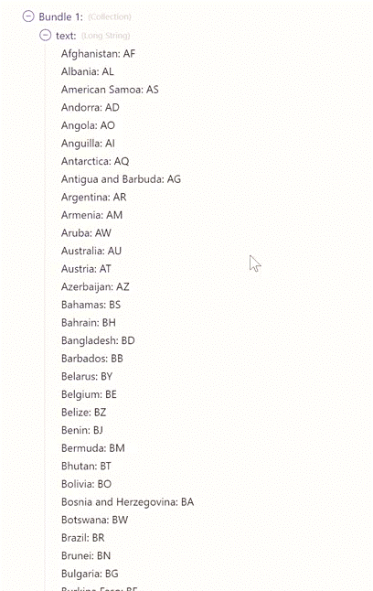

# Complex IF Formulas

__Things to remember:

1. Make can support very long if(...) functions that include multiple conditions and other if(...) functions inside.
2. You can use both __and / or__ operators to define your conditions.
3. In some instances, it might be just easier to copy your long function to a text editor and make your edits there.
4. Hovering over function names or opening/closing parenthesis in Make's modules will highlight the closing/opening parenthesis of the function.
   

## Using IF Function with multiple conditions to filter

__Demostration target:__

Building a scenario where we pull a list of countres with some data.

__Ower goal is to:__
1. Find all single-word countries where the first letter of their name does not match the first letter from their 2-digit ISO code.
2. Find all multiple-word countries where the first letter of their name does not match the first letter from their 2-digit ISO code.

__step 1__ - HTTP moudle

This moudle is for retriving the data (from link: https://hook.eu1.make.com/kjk2vjhwj8h3s8ff8ss4njgo5r0q14fj?data_requested=country_list)

__step 2__ - Iterator moudle

On this step we extract the data. each row seperate.

__step 3__ - Tools (Set Variable) moudle

This is where we do our __IF__ function for clssify the data (we separate it to 3 groups. 2 for our conditios and another for the rest (countrys where the first letter and the IDO 2 digit code are the same)
   

__step 4__ - Tools (Text aggragator) moudle

we get the values from the Iterator by the group set in the Set Variable Tool (step 3). 
we asked to get only country name and the 2-digit ISO code as output.

## Output

what we will get on the end (Text Aggragator) is a 3 boundle output where:
   1. __OK__ status - countrys with the same first letter in the name and the 2-digit ISO code.
   2. single-word countries where the first letter of their name does not match the first letter from their 2-digit ISO code.
   3. multiple-word countries where the first letter of their name does not match the first letter from their 2-digit ISO code.

__(bundle 1 detailed):__

  
# [<-- BACK](l4understandingtime.md) --- [NEXT -->](l4.md)

