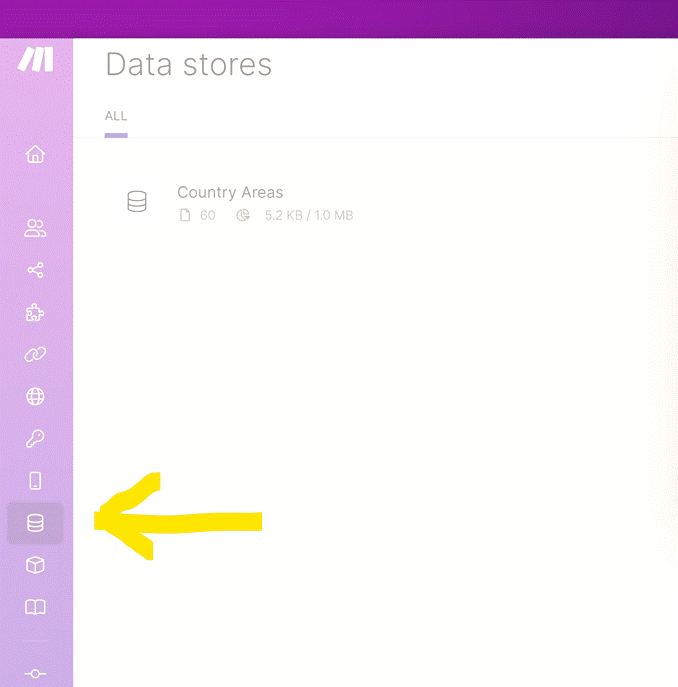
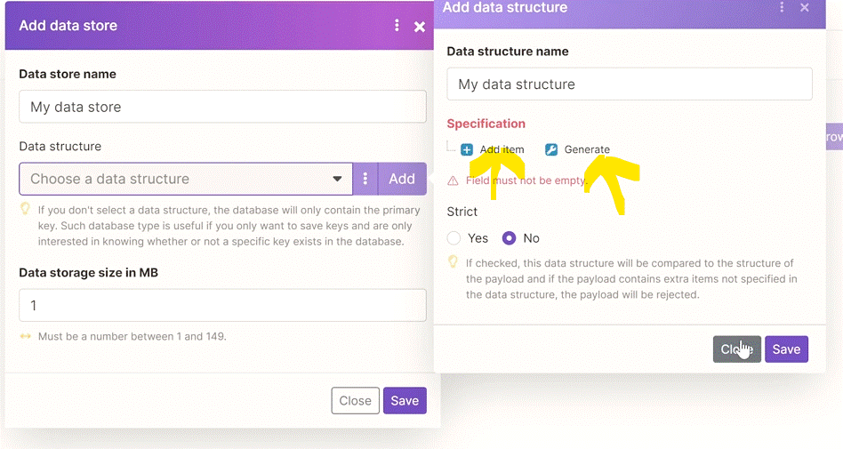
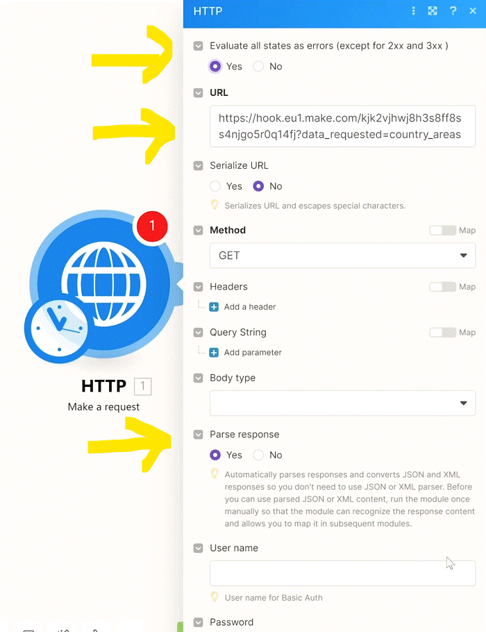
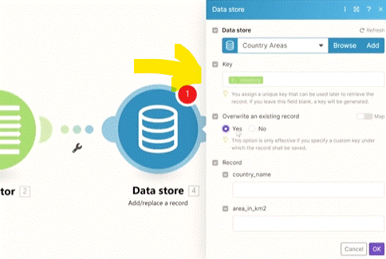

# Data Stores

We will look at Make's in-house databases called Data Stores.

Sample country areas data is here: 
https://hook.eu1.make.com/kjk2vjhwj8h3s8ff8ss4njgo5r0q14fj?data_requested=country_areas

__Try yourself:__

1. Get the country areas with the HTTP app.
2. Store all records in a Data Store. Keep in mind that you may need to define your Data Structure first unless you re-use an existing one!
3. Set up a second scenario that will download country areas from your new Data Store and send those results to yourself via email with another scenario.

   
__Things to remember:__

1. Data Stores are essentially __databases__ inside Make.
2. Data Stores allow you to store information that can be later re-used in your scenario executions.
3. Data Stores are much faster than e.g. Google Sheets or Airtable.
4. Every Data Store needs a Data Structure.
5. You can specify the size of your Data Store (the minimum size is 1 MB).
6. Beyond simple __texts__ and __numbers__, you can even store __arrays, collections, binary data__ (such as files), or __booleans__ in Data Stores - something which is not easily possible to do e.g. in Google Sheets.
7. For every 10,000 operations purchased in your plan, you will get 10 MB of storage for Data Stores.
8. You can have up to 1000 Data Stores in your Make organization if you are consuming a LOT of operations but keep in mind there is a __minimum size of 1 MB__ for each Data Store. So for example, if you purchased 200,000 monthly operations, the max number of Data Stores is 200,000/10,000*10/1= 200. (operations purchased/10,000 operations*10 MBs/minimum Data Store size).
9. Typically, you will be automatically feeding data to Data Stores from your scenarios but you also have the option to __add manual entries__ to your Data Stores.

## Data Store

you can see the __Data Store__ on the web;

   

Every __Data Store__ need to have a Data structure. you define it by difining the fields or automaticaly "generate" from a sample Data structure ( you can use already creted structures too)

   

## Automating Data Store

updata a Data Stroe automaticaly

__Http (make request) module__

This module will retrive the data from the link.

   

__Iterator module__

We iterating the data in order to get the individual countries out by iterating the data.

   

__Data Store (Add/replace a record) module__

The Data store give us a field base on the data structure we've defined in the Data Store as well as key field whichis ou uniqe key (Make will generate a key if you dont add one. we suggest to use a define uniqe key (using one of the field. ex. country name) this way we can avoid duplicat in the Data Store fields).

  

  

# [<-- BACK](l4datastuctures.md) --- [NEXT -->](l4arrayforadvanced.md)

