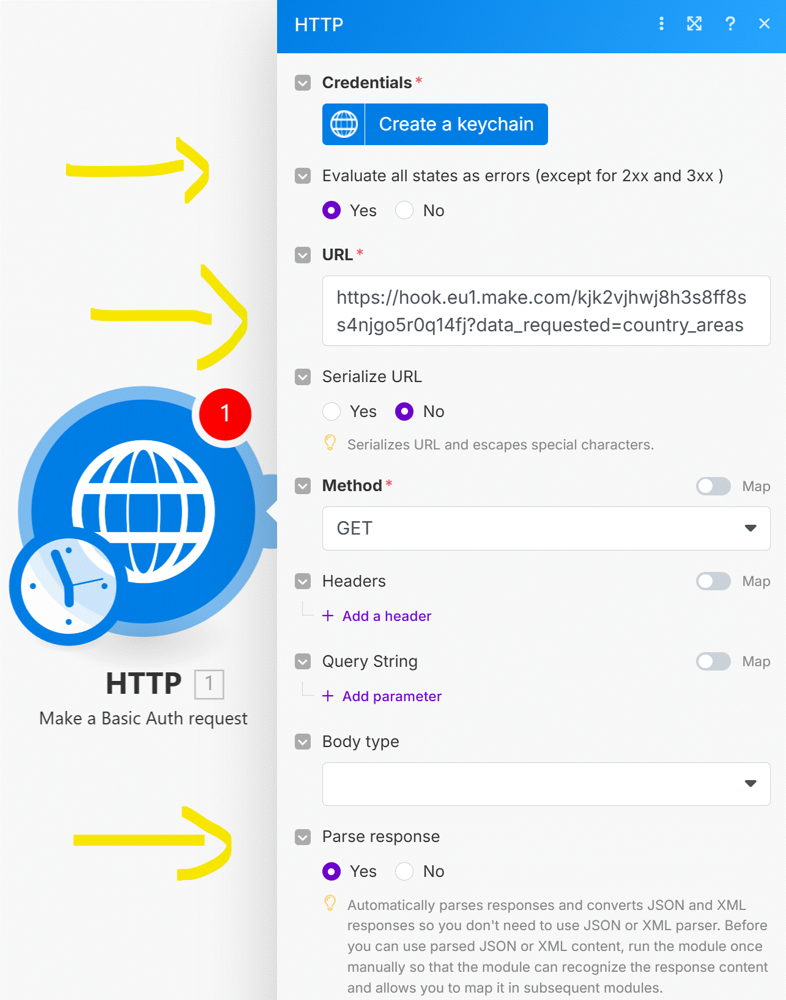
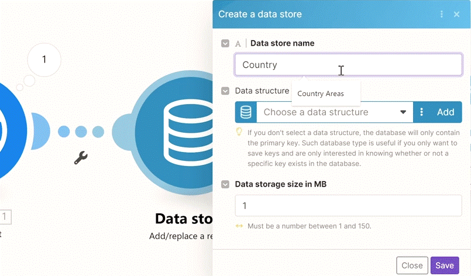
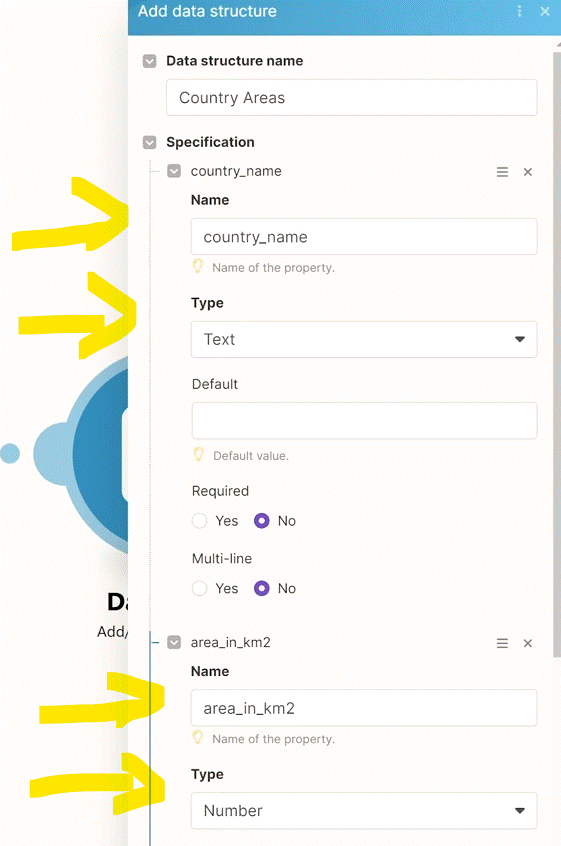
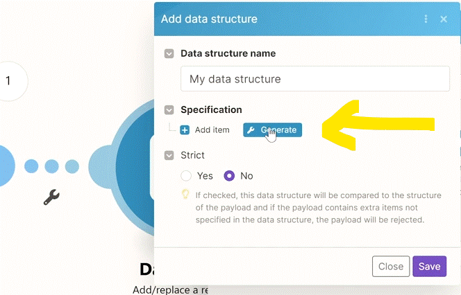
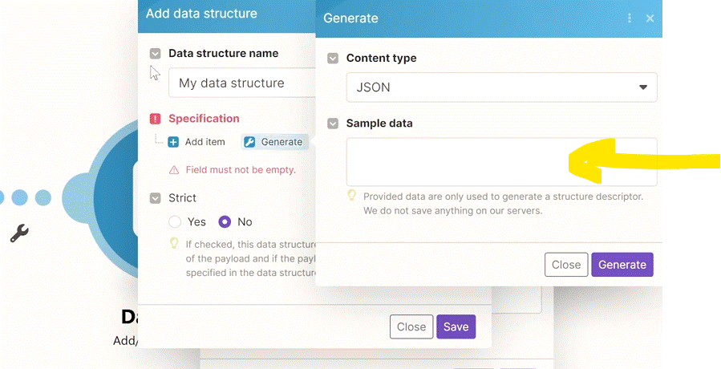
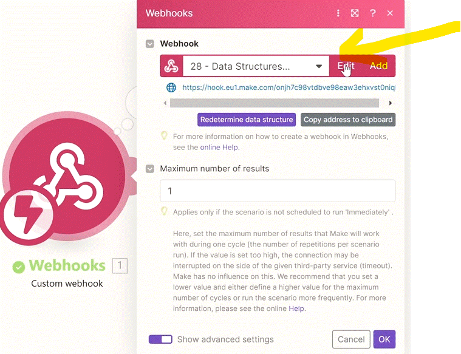
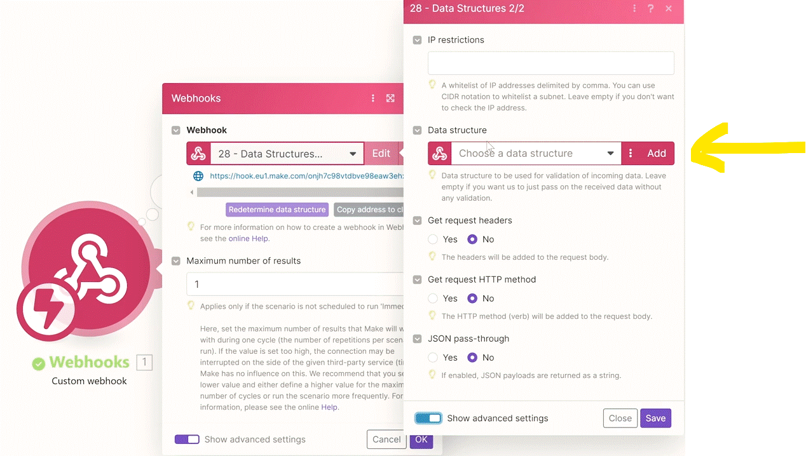
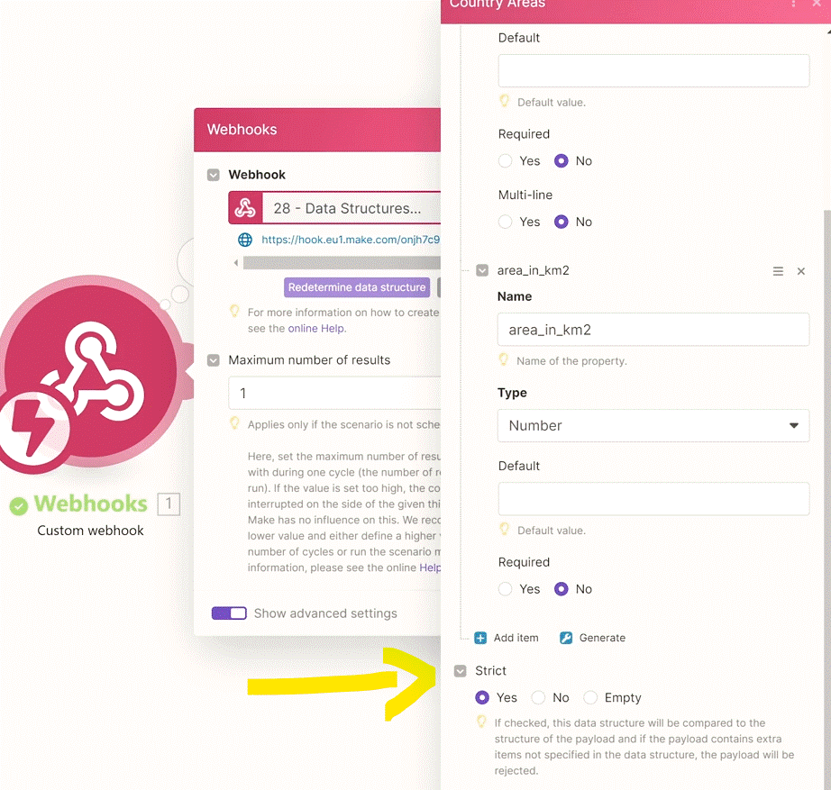
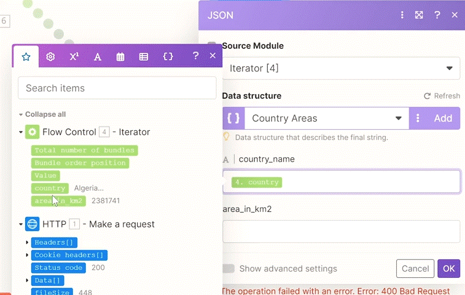
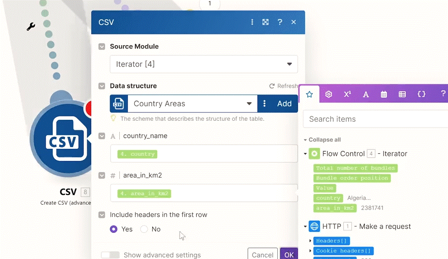

# Data Structures

We'll explain why you should care about Data Structures.

Sample country areas data is here: 
https://hook.eu1.make.com/kjk2vjhwj8h3s8ff8ss4njgo5r0q14fj?data_requested=country_areas

__Try yourself:__

1. Get the country areas with our HTTP app.
2. Aggregate the results to a CSV (make sure to use the "advanced module") while using a data structure.
3. Send an email with the CSV attachment to yourself.
   
__Things to remember:__

1. __Data Structures__ are a very important part of Make. They serve 3 main purposes:
   1. They allow you to specify the structure (or format) of data that is flowing through your Make scenarios. Depending on the use case, DaStr can be used to correctly __parse incoming data or to correctly compile output data__ in your modules.
   2. Within Webhooks>Custom Webhook module you can even use them as a __form of validation!__
   3. They describe the structure of __data stored in Data Stores__. A Data Structure is basically equivalent to a table schema in the standard database world.

2. You can re-use Data Structures across multiple modules and scenarios within Make - essentially setting a __single source of truth__ about the structure of certain chunks of data which you frequently work with.
3. __Most__ of the modules in Make __won't require__ you to use Data Structures. Some of the modules require you to use Data Structures (for example CSV>Create CSV [advanced]), and some of the modules make Data Structures only __optional__ (for example JSON>Parse JSON).
4. Existing Data Structures can be edited. Make sure you know what you are doing - if you remove or rename keys from an existing Data Structure that is already used in active scenarios, such change __may break the scenarios__ using that particular Data Structure.
5. Existing Data Structures can be also __cloned__.
6. If you have a sample JSON with real data, you can __generate your Data Structure automatically__ thanks to Make's "Generate" feature during Data Structure's setup.
7. The most commonly used apps and modules involving Data Structures:
   1. Data Stores app
   2. JSON>Aggregate to JSON
   3. JSON>Parse JSON
   4. JSON>Create JSON
   5. CSV>Create CSV (advanced)
   6. XML>Create XML
   7. XML>Parse XML
   8. Webhooks>Custom Webhook
   
### Data structue (in Make)

A data structure is a document that describes in details the format of the data being transferred to Make. Based on this document, the Scenario editor is able to figure out which module returns or recives which kind of data.
The data structure documents are most commonly used for serializing/parsing data formats such as JSON, XML, CSV and others.

the benefits that data structure bring are:
* Data structure allow you to specify the structure or format of data which is flowing through your MAke Scenario. Depending on the use case, data structure can used to correctly parse incoming data, or to correctly compile output data in your modules.
* Whithin Webhooks, custom webhook module, for example, you can use a Data strucure as a form of validation.
* Can define a Data structure once and then reuse it across multiple modules in scenarios within Make. Essentially setting a single source of truth about the structure of certian chunks of data, which you frequently work with.
  

### Sample Scenario - adding HTTP request

__HTTP (make request)__

pulling the data using HTTP module 

### Data store (internal databases of Make)

Adding the data into a data store

we add a __Data store__ module

1. we create a __Data store__ -  give it a name and declair.

   
   
2. specifing the data structure we need
    
   

__* Note__

you can import a structure (insted of declaring  what we did on step 2) by providing a already exsist structure. its done by pressing on the "__Generate__"" button (insted of "Add item"). and provide a JSON, XML FOrm data or a query string and Make will create the Data structure for you.
   
   

   

### Webhooks - Using Data structure

you can specify a data structure to webhook (by going to Edit and then showing the advance setting).

   

      
   
   
By doing so (setting a data structure to a __Webhook__). the Webhook will validate the input or the input data. and if it's different than it simple reject it and will not even __trigger__ the make Scenario. and there for also not consume any operations in order for it to work - decline whats not resemble to the data strucutre. there a need to set the strict switch in the advanced settings).

   

__*__ you will get an Error response on sending the data.

### Aggragate to JSON

using data structure to extract same Data structure

   

### Using Data structure in CSV 

we create a CSV (Create CSV (advanced))

   

   

# [<-- BACK](l4repeatertotackle.md) --- [NEXT -->](l4datastore.md)

