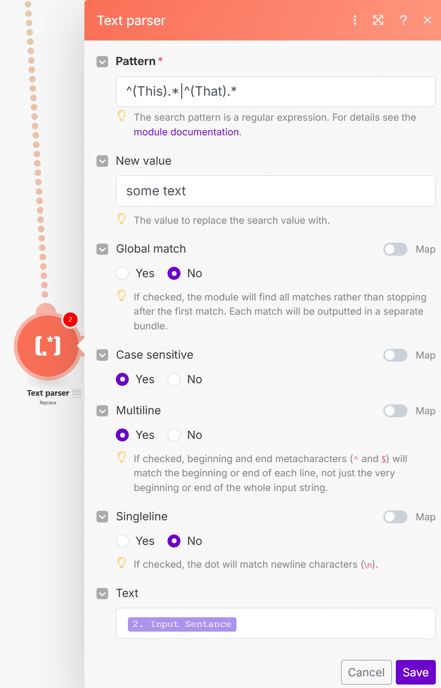

# Make DevTool

__Please note that "Integromat DevTool" was renamed to "Make DevTool" in 2024, the features stays as is.__

Let's look at the DevTool extension which can provide extra useful insights about your scenario executions!

Sample data used in the video is here:
https://hook.eu1.make.com/mvoybmpjdjj4qbillvv6aasorypv811c

__Try yourself:__

1. Get the DevTool extension from here (works with __any plan__ - https://chromewebstore.google.com/detail/make-devtool/ainnemkhpnjgkhcdkfbhmlenkhehmfhi?pli=1).
2. Open any active scenario in any of your Make organizations.
3. Open the extension.
4. Compare the information from the __Live Stream__ (you will need to capture a live execution) vs. __Scenario Debugger__.
5. Try __Copy Filter__ feature from __Tools__ to copy a filter from one module to another.
6. Get the Blueprint Size of the scenario - remember we add extra data on the top of the number you see in the extension when we store the scenario to our servers.

__Things to remember:__

1. DevTool provides 3 main groups of features:
   1. __Live Stream__ - insights into __currently running__ executions request by request.
   2. __Scenario Debugger__ - insights into past executions where the requests are grouped by scenario modules.
   3. __Tools__ - a set of features to make less common operations in Make possible with few clicks. Top features:
      1. Copy Filter
      2. Get Blueprint Size

2. Use DevTool to __debug random failures__ - the Response Body section of the requests tends to provide richer information about the API responses than the standard log at the bottom of the Scenario Builder.
3. PRO TIP: Grabbing the JSON responses from the DevTool can also be useful for __auto-generating your Data Structures__.
     

   

# [<-- BACK](l4textparser&regex.md) --- [NEXT -->](l4.md)

