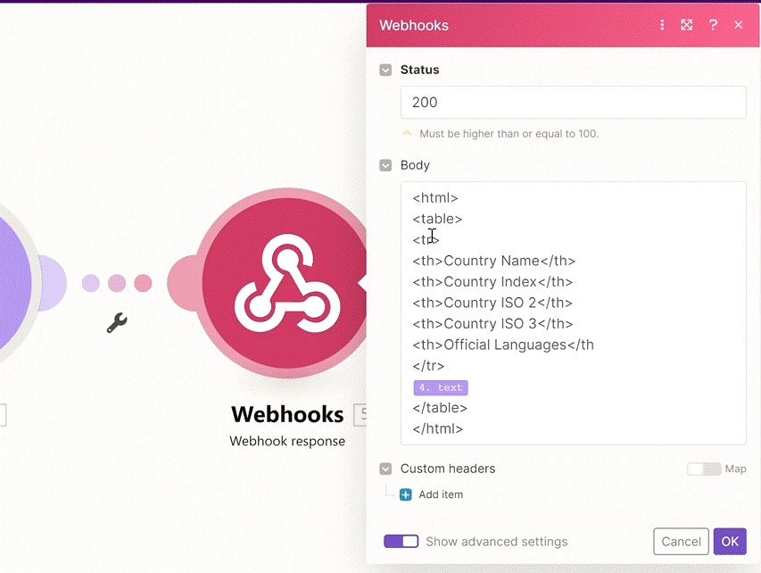

# Repeater to Tackle Pagination Challenges

   

We'll look at how to tackle pagination in Make with Repeater after getting paginated results from the HTTP app.

Sample country list data is here: 
https://hook.eu1.make.com/kjk2vjhwj8h3s8ff8ss4njgo5r0q14fj?data_requested=country_list

__Try yourself:__
1. Get country lists with our HTTP app.
2. If you don't include &page=... in the query strings, you'll get the first page.
3. If you include &page=page_X in the query strings, you'll get the specific page (page_1, page_2, page_3, page_4, page_5)
4. Follow Manuel's solution to retrieve paginated results.
5. Are you able to tell how many countries are there on the list across all our pages in less than 15 minutes from now?

__Things to remember:__

1. Generally speaking, Make will automatically handle pagination for you in all public apps on Make.
2. When you work with custom APIs via the HTTP app, it's possible you will need to deal with paginated data yourself. In that case, you will need to use __Repeater__.
3. There are several common patterns of paginated API responses:
   1. The API will tell you __how many pages of results__ there are in total and you need to iterate through all the results based on different parameters.
   2. The API will provide you with a reference for the "next page" or "next result" but will __not tell you__ how many pages/results there are in total. In this case, you will need to arbitrarily set a high enough number (yet reasonable) of __repeats__ in __Repeater__ so you will always get all the results as presented in our video (we used 100 repeats).
   3. The API works with an __offset__ - you need to repeatedly ask for "ranges of results" - e.g. for 0-500 results, then for 501-1000, then for 1001-1500, and so on.
   4. The API will tell you whether there are "__more items__" of the results waiting for you on the next page (e.g. until the "has_more_items" parameter "becomes" false on the last page).
   5. The API will not tell you whether there are more results waiting on the next page at all - you just need to keep asking for the next pages __until you get an empty response__.
      
4. __You should always study the API's documentation first__ to understand how exactly the pagination works in the particular API so you don't miss any important nuances. E.g,
   1. Are there any limits on the number of provided results? Maybe just 1000 records?
   2. Do you need to include any query string parameters to get the first page of results?
   3. How is the "next page" token parameter identified?
   4. Does the API tell you how many pages of results are there in total?
      
5. If you need to aggregate bundles with Array Aggregator and __you don't see items available for aggregation__ within the module, you can build a JSON via Text Aggregator, then parse the text with JSON>Parse JSON module, and finally, you can use Array Aggregator to aggregate the results from the Parse JSON module.
   1. You just need to make sure you properly escape special characters such as " or" /  (example to escape ": replace(your_mapped_value_here;";\") function in case your mapped values contain them.
   2. Stay tuned for 2 more tricks to solve this problem in an upcoming lessons around arrays :)

  
# [<-- BACK](l4advancedwebhooks.md) --- [NEXT -->](l4.md)

