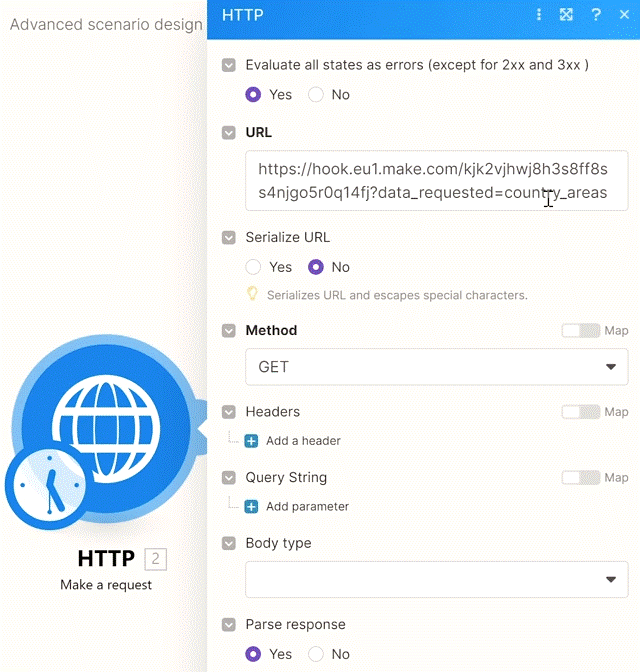
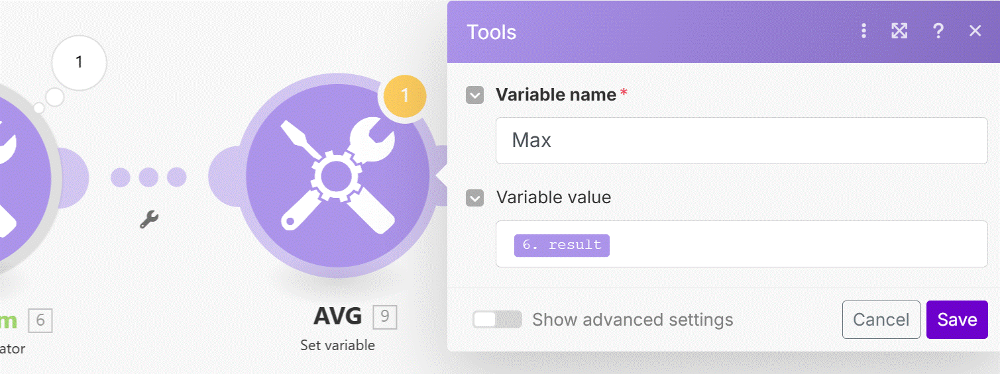

# Advanced Scenario Design Patterns

Let's look at a few advanced scenario design patterns which you will sooner or later need when solving complex problems with Make.

Sample data used in the video:
https://hook.eu1.make.com/kjk2vjhwj8h3s8ff8ss4njgo5r0q14fj?data_requested=country_areas

__Try yourself:__

1. Follow Manuel in building the "duplicate check" logic. Create a Google Sheet yourself. Also, make sure to implement the __error handling__ mentioned in chapter 25 otherwise your scenario will occasionally fail :)
2. Try to get the __max, min, and avg__ values of the country areas by using the two methods (aggregators vs array functions).
3. Try passing any data between scenarios while using __Make app__ and __Scenario inputs__ in the "receiving scenario" (for this, you will need a Pro plan or above).

__Things to remember:__

1. __Preventing duplicates__
   1. It's likely that when you are creating new records in an app, you should check whether such a particular already exists in the target app so you don't create a duplicated record.
   2. If you find an existing value, then you should either stop your creation process OR you should update the existing value in the target app depending on your business logic.
   3. It's extremely important to define the right "key" for determining whether the record exists or not - it can be an ID, email, phone number, user ID, or any other value which would be unique in the target app. The key always depends on the app you are working with.
      
2. __Passing data between routes__ (sometimes known as Converger workaround)
   1. Set/Get Variables modules to allow you to pass data between routes but you need to make sure the order of your routes is set correctly.
  
3. __Calculation of "aggregated" values__ such as Min, Max, Avg, or concatenated strings.
   1. There can be multiple solutions to your problem
   2. If you know how to use inline array functions, you may save yourself from using aggregators but it depends on the specific problem you are trying to solve. Sometimes you may simply need to use aggregators.
      
4. __Passing data between scenarios__
   1. You can use HTTP POST requests and Custom Webhooks to send data between scenarios.
   2. However, you can also use __Make app>Make an API Call__ and __Scenario inputs__ to pass data in a __more secure authorized way__ between your scenarios!
      1. By default, the receiving scenario will be executed in parallel but you can switch it to sequential processing in the scenario's settings.

5. __Scenario inputs__ not only allow you to pass data between scenarios but they also simplify inputs for end users. For example, if you need to allow your coworkers to run certain scenarios on demand while having the coworkers provide many inputs, you can use Scenario inputs to allow them to __enter all the inputs just in one place__ instead of forcing them to go to various modules in the scenario.

## Example 1 - preventing duplicates

    

__HTTP (Make a request) module__

Pulilng the data.

    

__Iterate Module__

Iterating the data each country seperate.

    

__Google Sheets (Search Rows) module__

Serching if the data exsist in the google sheet (called "ARE List"). and we filter the data by country name "Equal to" the country that we get from the data.
__*note__ 
   1. the country name is the eniqe value (cant be repeted).
   2. we set the maximum number of return rows to 1 (there shouldnt be more because its a uniqe value).

    

__Router module__

we use 2 filters for the route:
   1. Country exist (filter).

 

   if it exist we __Update__ the row:

__Google Sheets (Update Row) module__

 

 

   2. country not exist (filter).

 

__Google Sheets (Add Row) module__

Adding a row to the Google sheet with the new values:

 

## Example 2 - Get the Min, Max values of the area (in km2)

 

__HTTP (Make a request) module__

Pulilng the data.

    

__Iterate Module__

Iterating the data each country seperate.

    

__Tools (Numeric aggragator) module__

We use the __Numeric aggragator__ to calculate the avarage, min and max values of the area (we added a router to switch between tasks).

    

    

    

In order to combine the resulst (if we ned to pass them on) we crate a "Set Variable" for each calculation and use a route to use those variables.

    

       

    

__Tools (Get Multiple Variables)__
   
On a new route we add a "Get Multiple Variables" module and extract all the calculation (variables) in order to proceed the scenario (ex sending by email)

    

   
__Gmail module__

sending the result by email

    

__* NOTE__

another way of doing the same scenario only by using functions.

    

     

## Example 3 - Execute a Scenario with multiple trigger into one scenario
   
       

we set a Make an API Call to trigger another scenario.

__Make an API Call__

This module set a trigger by sending to another scenario (it set in the URL)

       

__*note__ 
1. you can crate multiple of those. where each trigger the same call.
2. if you pass more variables then needed the API will fail (the other scenario wont run at all).
3. it will fail too if you dont pass a requierd variable.

__second scenario - the triggered by the API Call__

we crate a scenario which will be trigger by the API call's we crated.

on the scenario we have to create a scenario inputs (note the start scenario sign is now set to on demand)

__*Note__ if there are no requered inputs (must field). you can run the scenario not just in on demand. it can run on schaduale and wil also be triggered by the API call.
   
To configure the __Sceanrio Inputs__ on the bottom and set the input variables we going to recive from the API.

       

on the triggered scenario we set __Get Variable module__ that will get the inputs that was send by the trigger scenario.

       

# [<-- BACK](l4arrayoperations.md) --- [NEXT -->](l4.md)

