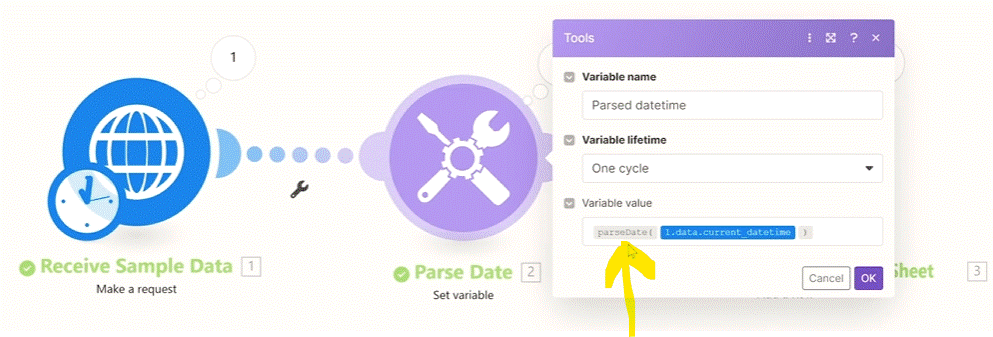

# Understanding Time and Timezones in Make

__Things to remember:__

1. What you see may not always be what you get when it comes to times in Make.
2. User-level timezone settings control:
   1. How times are displayed in modules' outputs in Make's Scenario Builder.
   2. How times are displayed on the History tab in scenario logs.
      
3. Organization level timezone settings control:
   1. Schedules of your scenarios.
   2. The default behavior of date/time functions such as formatDate(...) or parseDate(...) if there are no timezones specified in their parameters.
      
4. To minimize potential confusion, the best approach is to use the same User and Organization level timezone settings where possible.

In __Make__ there are two setting of __TimeZone__ you have to consider.

  1. __organization__ TimeZone - refer to the TimeZone where the Organization is.
  2. __User__ TimeZOne - refer to the TimeZone of the __User__.

__Setting Organization TimeZone__

Setting the Orgnization TimeZone is done:

  Navigate to the organization tab on the menu --> Press on the "organization Setting" button. and set the TImeZone you wish.

__Setting User TimeZone__

Setting the User TimeZone is done:

  Navigate to the Protile tab on the menu (left side) --> Press on the "Change details" button. and set the TImeZone you wish.

In most scenarios. the __TimeZone__ is set by the __User__ TimeZone (it convert the time if needed to set the right time between geographic locations (ex. if you recive a timezone from USA in a script the user is in Europe. the time that will be converted to the EURO time)). there are some cases wher it set by the organization Time Zone.

__FormatDate(...) Function__

The time that will be used by this function will be determinated according to the __Organization TimeZone__ setting (it will adjust by the Time it gets from previous modules).

__Schedule Time__

Schedule a scenrio time is __Allways__ set by the Organization TimeZone (if you change the Organizatin TimeZone. the schedule time wont change it just will start on that time in the new timezone setting (if the schedual was set to 9:30 when it was in the first timezone. on changinf the organization timezone. it still will start at 9:30 but on the new timezone clock))

__* Tip__

Make sure to use the same __user__ timezone as the __organization__ time zone for the sake of simplicity.

  
# [<-- BACK](l3realaiusecase.md) --- [NEXT -->](l4.md)

