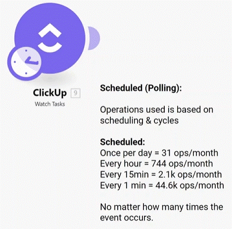
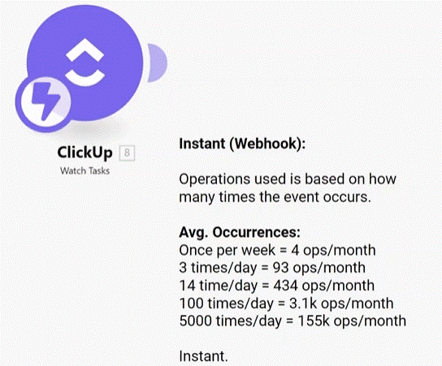

# Plans and operations 

1. Most of the modules will charge you operations as bundles flow through them but there are exceptions (such as Router, Error Handlers, Sleep, and filters) that do not cost any operations.
2. The scheduled module (Polling trigger) will always consume one operation, even if no event occurs.
3. The instant module (webhook) consumes operations based on how many times the event occurs.
4. The data transfer allowance is 5GB for 10k monthly operations.
5. You will get an email notification when 75% of operations are consumed and then another one at 90%.
6. Use inline functions to process the information within a module in order to save operations.
7. Use modules that pull data in bulk rather than one at a time.

* __Pro tip:__ You can export scenario blueprints on all Make plans and send them e.g. via email to your coworkers.

## Triggers and operation

triggers are wher a scenario begain. there are two tirgers, watching and polling:

__Scheduled (polling) Trigger__

__Instant (Webhook)__

# [<-- BACK](troubleshooting.md) --- [NEXT -->]()

