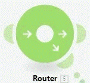
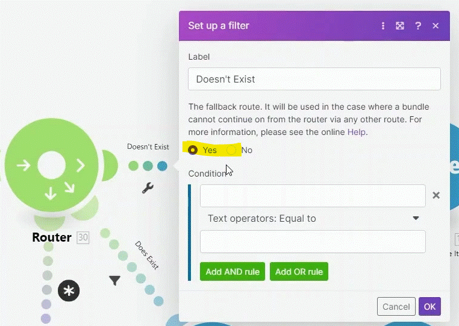
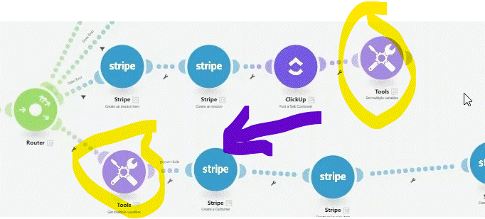
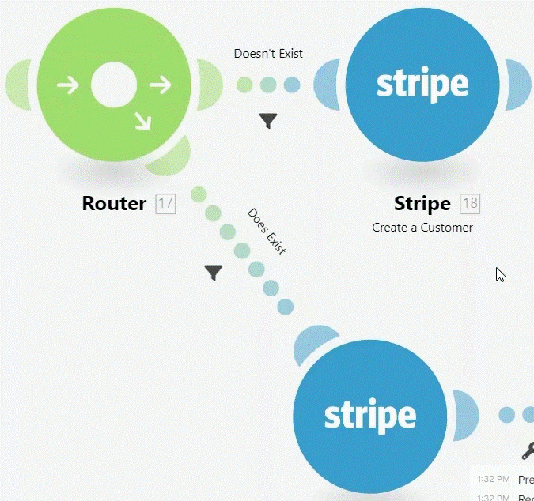

# Routers and Filters

1. It's extremely important to use the correct data type operators when setting up filters. "Contains" from Text operators is not the same as "Contains" from Array operators.
2. Make sure you understand in which order the routes behind a router are executed (=based on the order they were connected to the router).
3. Changing the order of routes behind a router can be solved in 3 ways:
   1. You can simply delete the router and add a new one to the same position and link subsequent routers in the desired order.
   2. You can unlink the existing routes and then link them in the desired order.
   3. Right click a Router and reorder the routes in the pop up by dragging and dropping them.
  
4. Filters can be used after any module.
5. The Auto-align button can help you quickly organize your complex scenarios.

## Router

allow automation to branch in different direction.

   * Routers can have as many connection as you want.
   * Router will execut all the automation in the order the connection where set ( you can see the order presented on the connection ( if you cant see- press right mouse on the white board and click "show router order" (also if you press the "auto-align" button it will arrange the router connections in the executing order).
   *  In order to change the connection order you  can by disconnecting them and reconecting in the order you wish (or right click on the router, chose Order routes and change the order in the dpop display pane).
   *  __fallback__ a default rout connect to the router that will only execute if other connection wont executed (set it by seting "yes" in the connection screen).

 
 
   * The router module as __NO Operation Cost__.

__* Tip__

to combine branches operation we can use variable tool t pass variables between branches

 
 
## Filter

deside if the automation continue in any perticuler branch.

__note__ 
   * in the condition you must chose from one that apropied to the type of the variable (ex. if you get a text variable. chose from the condition under text operations).
   * if you break a branch the filter stay with the modle that is after the filter (if you delete the module after. thefilter will pass to the next module in the branch).

__Condition logic__

combinding router with filter allow to to create a condition logic (if a condition occured only one branch will be deployed. ex. router for 2 branch wher a filter set to one branch "if exist" and the other for "not exist")

     

# [<-- BACK](date_and_general_inline_functions.md) --- [NEXT -->](troubleshooting.md)

